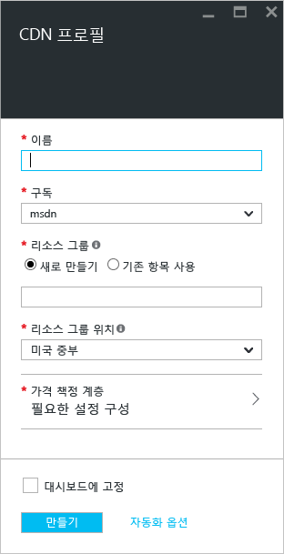
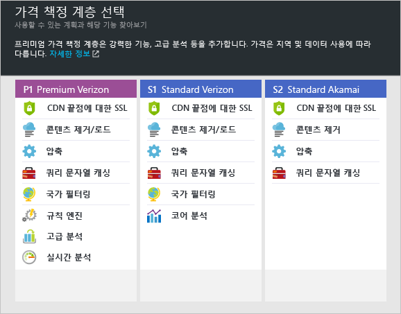

**새 CDN 프로필을 만들려면**

1. [Azure Portal](https://portal.azure.com)의 왼쪽 위에서 **리소스 만들기**를 선택합니다.
    
2. **새로 만들기** 블레이드에서 **웹 + 모바일**, **CDN**을 차례로 선택합니다.
   
    **CDN 프로필** 블레이드가 나타납니다.
   
    
3. **이름**에는 CDN 프로필의 고유한 이름을 입력합니다.
    
4. **구독**에서는 이 CDN 프로필에 사용할 구독을 선택합니다.
   
5. **리소스 그룹**에서는 리소스 그룹을 선택하거나 만듭니다. 리소스 그룹에 대한 자세한 내용은 [Azure Resource Manager 개요](../articles/azure-resource-manager/resource-group-overview.md#resource-groups)를 참조하세요.
    
6. **리소스 그룹 위치**에서는 CDN 프로필 정보를 저장할 Azure 위치를 선택합니다. 이 위치는 CDN 엔드포인트 위치에 영향을 주지 않습니다.
    
7. **가격 책정 계층**에서는 계층을 선택합니다. 각 가격 책정 계층에 사용할 수 있는 기능을 비교하려면 [Azure CDN 기능](../articles/cdn/cdn-overview.md#azure-cdn-features)을 참조하세요.
   
    

8. 필요에 따라 **지금 새 CDN 엔드포인트 만들기**를 선택하여 프로필을 만드는 동시에 엔드포인트를 만드는 옵션을 표시합니다. 자세한 내용은 [새 CDN 엔드포인트 만들기](../articles/cdn/cdn-create-new-endpoint.md#create-a-new-cdn-endpoint)를 참조하세요.
   
9. 프로필을 만든 후 쉽게 찾을 수 있도록 대시보드에 저장하려면 **대시보드에 고정**을 선택합니다.
    
10. **만들기**를 선택하여 프로필을 만듭니다. 

