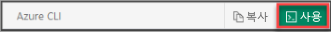

## Azure Cloud Shell 사용

Azure는 브라우저를 통해 사용할 수 있는 대화형 셸 환경인 Azure Cloud Shell을 호스트합니다. Cloud Shell에서 Bash 또는 PowerShell을 사용하여 Azure 서비스 작업을 수행할 수 있습니다. 로컬 환경에 아무 것도 설치할 필요 없이 Azure Cloud Shell의 미리 설치된 명령을 사용하여 이 문서의 코드를 실행할 수 있습니다.

Azure Cloud Shell을 시작하려면 다음을 수행합니다.

| 옵션 | 예제/링크 |
|-----------------------------------------------|---|
| 코드 블록의 오른쪽 위 모서리에서 **사용** 을 선택합니다. **사용해보기** 를 선택하면 코드가 Cloud Shell에 자동으로 복사되지 않습니다. |  |
| [https://shell.azure.com](https://shell.azure.com)으로 이동하거나 **Cloud Shell 시작** 버튼을 선택하여 브라우저에서 Cloud Shell을 엽니다. |  |
| [Azure Portal](https://portal.azure.com)의 오른쪽 위에 있는 메뉴 모음에서 **Cloud Shell** 단추를 선택합니다. |  |

이 문서의 코드를 Azure Cloud Shell에서 실행하려면 다음을 수행합니다.

1. Cloud Shell을 시작합니다.

1. 코드 블록의 **복사** 단추를 선택하여 코드를 복사합니다.

1. Windows 및 Linux에서 **Ctrl**+**Shift**+**V** 를 선택하거나 macOS에서 **Cmd**+**Shift**+**V** 를 선택하여 코드를 Cloud Shell 세션에 붙여넣습니다.

1. **Enter** 를 선택하여 코드를 실행합니다.
