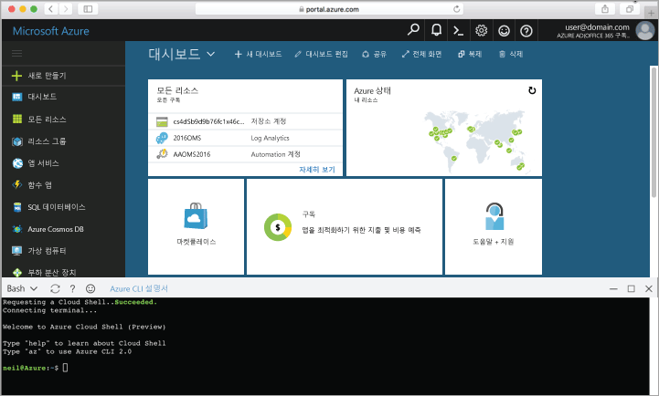

## Azure Cloud Shell 시작

Azure Cloud Shell은 Azure Portal에서 직접 실행할 수 있는 평가판 Bash 셸입니다. Azure CLI가 사전 설치되어 계정에서 사용하도록 구성되어 있습니다. [Azure Portal](https://portal.azure.com)의 오른쪽 위 모서리에 있는 메뉴에서 **Cloud Shell** 단추를 클릭합니다.

이 단추는 이 항목의 모든 단계를 실행하는 데 사용할 수 있는 대화형 셸을 시작합니다.

