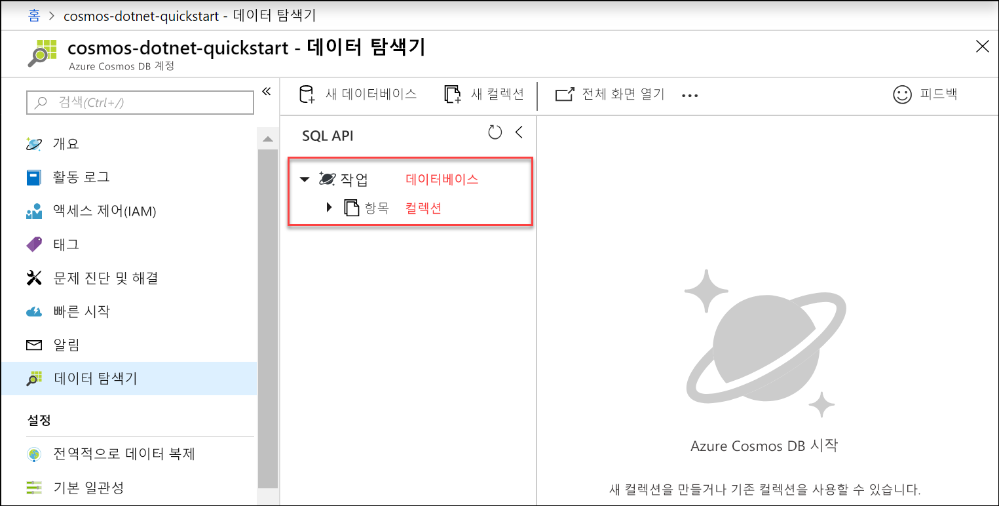

이제 Azure Portal에서 데이터 탐색기 도구를 사용하여 데이터베이스 및 컬렉션을 만들 수 있습니다. 

1. **데이터 탐색기** > **새 컬렉션**을 클릭합니다. 
    
    **컬렉션 추가** 영역이 맨 오른쪽에 표시되면 확인하기 위해 오른쪽으로 스크롤해야 합니다.

    

2. **컬렉션 추가** 페이지에서 새 컬렉션에 대한 설정을 입력합니다.

    설정|제안 값|설명
    ---|---|---
    데이터베이스 ID|*작업*|새 데이터베이스의 이름으로 *작업*을 입력합니다. 데이터베이스 이름은 1-255자여야 하며, /, \\, #,? 또는 후행 공백은 포함할 수 없습니다.
    컬렉션 ID|*Items*|새 컬렉션의 이름으로 *항목*을 입력입니다. 컬렉션 ID에는 데이터베이스 이름과 동일한 문자 요구 사항이 적용됩니다.
    데이터베이스 처리량 프로비전|비워 둠|Azure Cosmos DB는 데이터베이스 수준(데이터베이스의 모든 컬렉션은 동일한 처리량을 공유) 또는 컬렉션 수준에서 처리량을 프로비전할 수 있습니다. 이 특정 컬렉션에 대해 컬렉션 수준에서 처리량을 프로비전하려면 비워 둡니다.
    Storage 용량|*무제한*|**무제한**의 스토리지 용량을 선택합니다. 
    파티션 키|*/category*|파티션 키로 "/category"를 입력합니다. 파티션 키를 설정하면 Azure Cosmos DB에서 애플리케이션의 스토리지 및 처리량 요구를 충족하도록 컬렉션을 확장할 수 있습니다. 일반적으로 파티션 키에 적합한 선택은 다양한 범위의 고유 값을 갖는 것이며, 그 결과 워크로드에서 스토리지 및 요청 볼륨의 균등한 분포를 가져옵니다. [분할에 대해 자세히 알아봅니다.](../articles/cosmos-db/partitioning-overview.md)
    처리량|*400RU/s*|처리량을 400RU/s(초당 요청 단위)로 변경합니다. 대기 시간을 줄이면 나중에 처리량을 늘릴 수 있습니다. 
    
    앞의 설정 외에도 선택적으로 컬렉션에 대한 **고유 키**를 추가할 수 있습니다. 이 예에서 필드는 비워 두겠습니다. 고유 키는 데이터베이스에 데이터 무결성 계층을 추가할 수 있는 기능을 개발자에게 제공합니다. 컬렉션을 만드는 동안 고유 키 정책을 만들면 파티션 키당 하나 이상의 값에 대한 고유성이 보장됩니다. 자세한 내용은 [Azure Cosmos DB의 고유 키](../articles/cosmos-db/unique-keys.md) 문서를 참조하세요.
    
    **확인**을 클릭합니다.

    데이터 탐색기는 새 데이터베이스 및 컬렉션을 표시합니다.

    