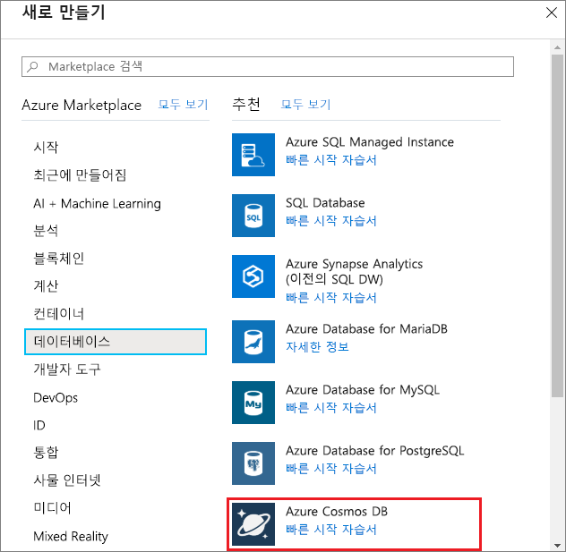
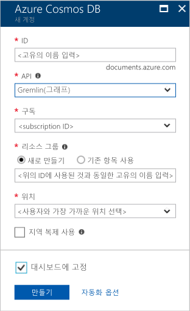

1. 새 창에서 [Azure Portal](https://portal.azure.com/)에 로그인합니다.

2. 왼쪽 창에서 **새로 만들기** > **데이터베이스** > **Azure Cosmos DB** > **만들기**를 선택합니다.
   
   

3. **새 계정** 아래에서 이 Azure Cosmos DB 계정에 원하는 구성을 지정합니다. 

    Azure Cosmos DB를 사용하면 Gremlin(그래프), MongoDB, SQL(DocumentDB) 및 테이블(키-값)의 4가지 프로그래밍 모델 중 하나를 선택할 수 있습니다. 각 모델에는 현재 별도 계정이 필요합니다.
       
    이 빠른 시작 문서에서는 Graph API를 프로그래밍하므로 양식을 작성할 때 **Gremlin(그래프)**를 선택합니다. 카탈로그 앱의 문서 데이터, 키/값(테이블) 데이터 또는 MongoDB 앱에서 마이그레이션한 데이터가 있는 경우, Azure Cosmos DB에서는 모든 중요 업무용 응용 프로그램에 대해 전 세계 분산형 고가용성 데이터베이스 서비스 플랫폼을 제공할 수 있습니다.

    다음 스크린샷의 정보를 지침으로 사용하여 **새 계정** 블레이드의 필드를 채웁니다. 값은 스크린샷의 값과 다를 수 있습니다.
 
    

    설정|제안 값|설명
    ---|---|---
    ID|*고유 값*|이 Azure Cosmos DB 계정을 식별하는 고유한 이름입니다. URI를 만들기 위해 제공하는 ID에 *documents.azure.com*이 추가되므로 식별할 수 있는 고유한 ID를 사용합니다. ID는 소문자, 숫자 및 하이픈(-) 문자만 포함할 수 있으며, 3-50자여야 합니다.
    API|Gremlin(그래프)|이 문서의 뒷부분에서 [Graph API](../articles/cosmos-db/graph-introduction.md)를 프로그래밍합니다.|
    구독|*사용자의 구독*|이 Azure Cosmos DB 계정에 사용할 Azure 구독입니다. 
    리소스 그룹|*ID와 동일한 값*|계정의 새 리소스 그룹 이름입니다. 간단히 하기 위해 ID와 동일한 이름을 사용할 수 있습니다. 
    위치|*사용자와 가장 가까운 지역*|Azure Cosmos DB 계정을 호스트할 지리적 위치입니다. 데이터에 빠르게 액세스할 수 있도록 사용자와 가장 가까운 위치를 선택합니다.

4. **만들기**를 선택하여 계정을 만듭니다.

5. 도구 모음에서 **알림** 아이콘 을 선택하여 배포 프로세스를 모니터링합니다.

    

6. **알림** 창이 배포 성공을 표시하는 경우 창을 닫습니다. **대시 보드**의 **모든 리소스** 타일에서 새 계정을 엽니다. 

    