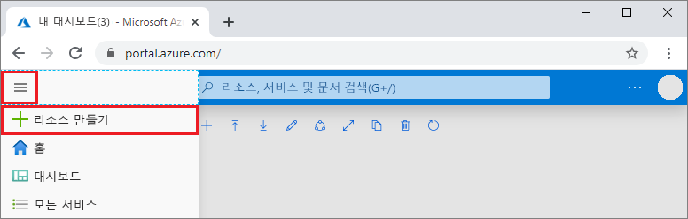
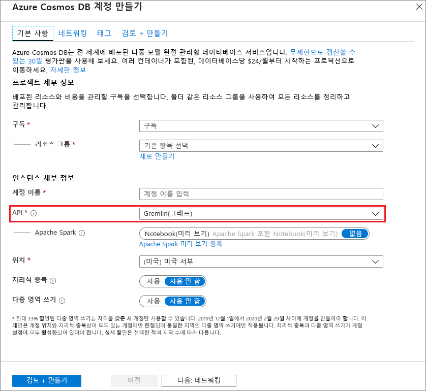
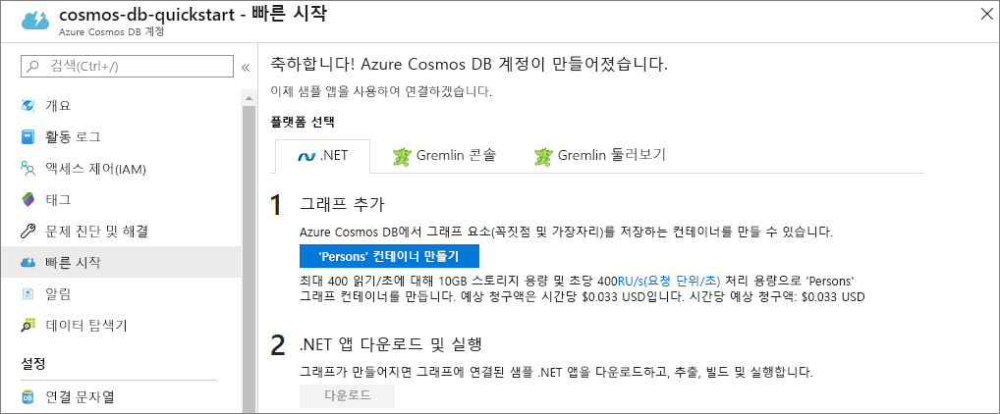

1. 새 브라우저 창에서 [Azure Portal](https://portal.azure.com/)에 로그인합니다.

2. 왼쪽 메뉴에서 **+ 리소스 만들기**를 선택합니다.
   
   
   
3. **새로 만들기** 페이지에서 **데이터베이스** > **Azure Cosmos DB**를 차례로 선택합니다.
   
   
   
   > [!TIP]
   > 목록에 Azure Cosmos DB가 표시되지 않으면 페이지 상단에 있는 검색 상자에 입력하고 _Enter_ 키를 누릅니다. 

3. **Azure Cosmos DB 계정 만들기** 페이지에서 새 Azure Cosmos DB 계정에 대한 설정을 입력합니다. 
 
    설정|값|Description
    ---|---|---
    Subscription|사용자의 구독|이 Azure Cosmos DB 계정에 사용하려는 Azure 구독을 선택합니다. 
    리소스 그룹|새로 만들기  그런 다음, 계정 이름과 같은 이름 입력|**새로 만들기**를 선택합니다. 그런 다음, 계정의 새 리소스 그룹 이름을 입력합니다. 간단히 하기 위해 Azure Cosmos DB 계정 이름과 동일한 이름을 사용합니다. 
    계정 이름|고유한 이름을 입력합니다.|내 Azure Cosmos DB 계정을 식별하는 고유한 이름을 입력합니다. 계정 URI는 고유한 계정 이름에 *gremlin.azure.com*이 추가됩니다.  계정 이름은 소문자, 숫자 및 하이픈(-) 문자만 포함할 수 있으며, 3-31자여야 합니다.
    API|Gremlin(그래프)|API는 만들 계정의 형식을 결정합니다. Azure Cosmos DB는 문서 데이터베이스용 Core(SQL), 그래프 데이터베이스용 Gremlin, 문서 데이터베이스용 MongoDB, Azure Table 및 Cassandra의 5가지 API를 제공합니다. 각 API에 대한 별도의 계정을 만들어야 합니다.   이 빠른 시작에서는 Gremlin API를 사용하는 테이블을 생성하므로 **Gremlin(그래프)** 을 선택합니다.   [Gremlin API에 대해 자세히 알아보세요](../articles/cosmos-db/graph-introduction.md).|
    위치|사용자와 가장 가까운 지역 선택|Azure Cosmos DB 계정을 호스트할 지리적 위치를 선택합니다. 데이터에 가장 빨리 액세스할 수 있도록 사용자와 가장 가까운 위치를 사용합니다.

    **검토+만들기**를 선택합니다. **네트워크** 및 **태그** 섹션을 건너뛸 수 있습니다. 

    

4. 계정 생성에는 몇 분 정도가 소요됩니다. 포털에서 **축하합니다! Azure Cosmos DB 계정이 만들어졌습니다.** 페이지가 표시될 때까지 기다립니다.
   
   

