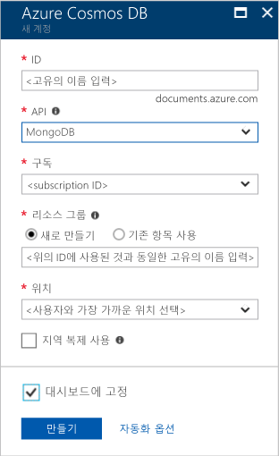
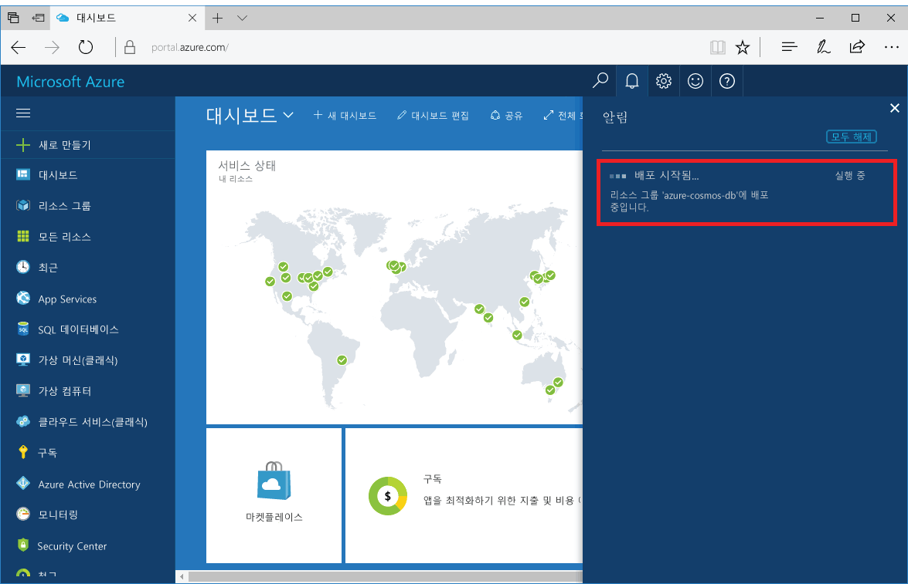
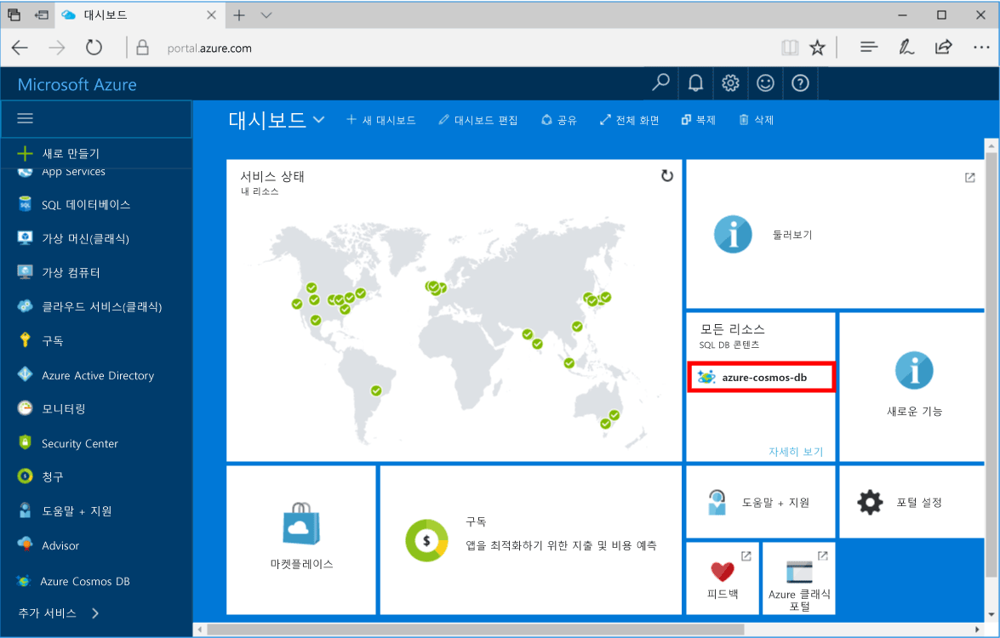

1. 새 창에서 [Azure Portal](https://portal.azure.com/)에 로그인합니다.
2. 왼쪽 메뉴에서 **리소스 만들기**, **데이터베이스**를 차례로 클릭한 다음, **Azure Cosmos DB**에서 **만들기**를 클릭합니다.
   
   

3. **새 계정** 블레이드에서 **MongoDB**를 API로 지정하고, Azure Cosmos DB 계정에 대해 원하는 구성을 작성합니다.
 
    

    * **ID**는 Azure Cosmos DB 계정을 식별하는 데 사용하려는 고유한 이름이어야 합니다. 소문자, 숫자, '-' 문자만 포함할 수 있으며, 3-50자여야 합니다.
    * **구독**은 사용자의 Azure 구독입니다. 해당 사용자에 대한 구독을 작성합니다.
    * **리소스 그룹**은 Azure Cosmos DB 계정의 리소스 그룹 이름입니다.
    * **위치**는 Azure Cosmos DB 인스턴스가 있는 지리적 위치입니다. 사용자에게 가장 가까운 위치를 선택합니다.

4. **만들기**를 클릭하여 계정을 만듭니다.
5. 도구 모음에서 **알림**을 클릭하여 배포 프로세스를 모니터링합니다.

    

6.  배포가 완료되면 모든 리소스 타일에서 새 계정을 엽니다. 

    
