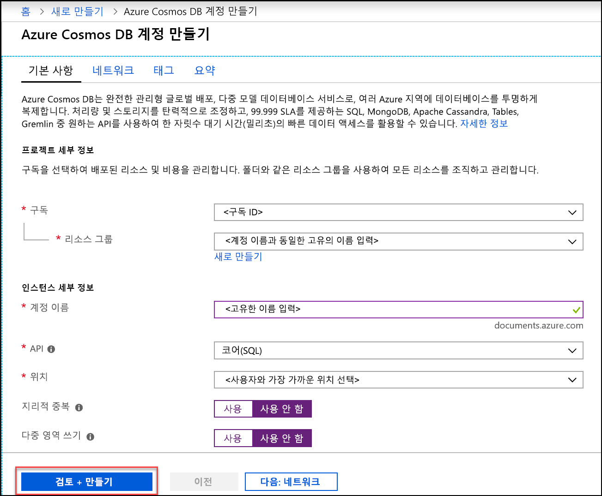
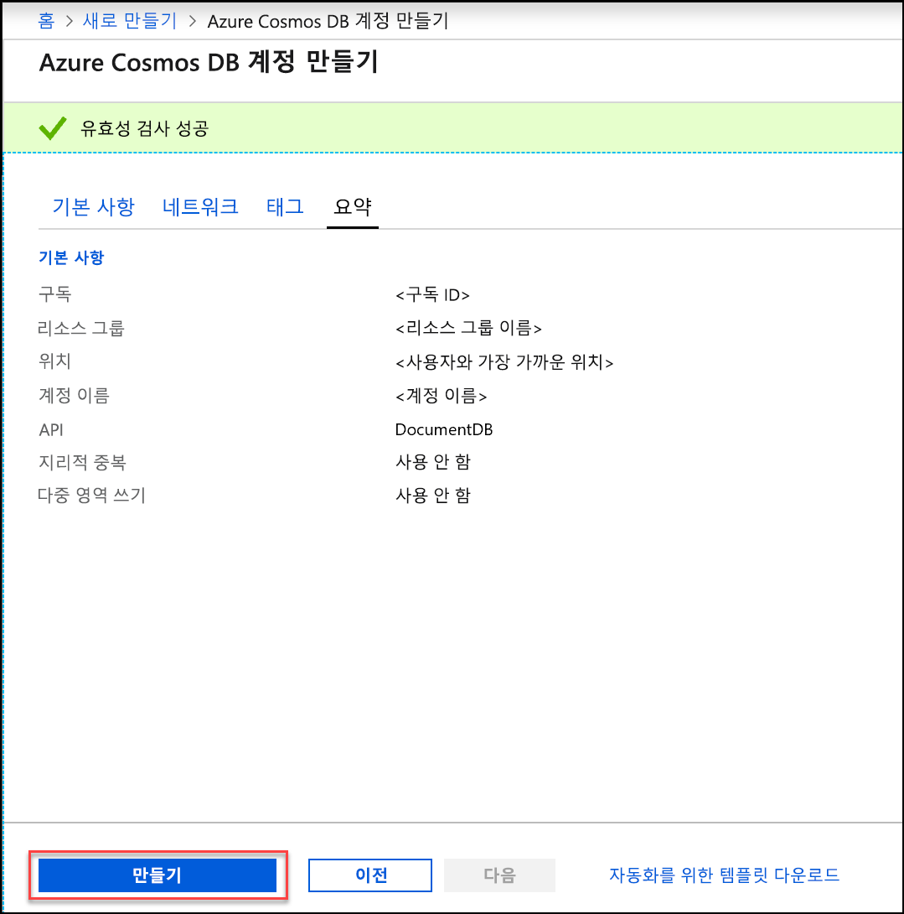
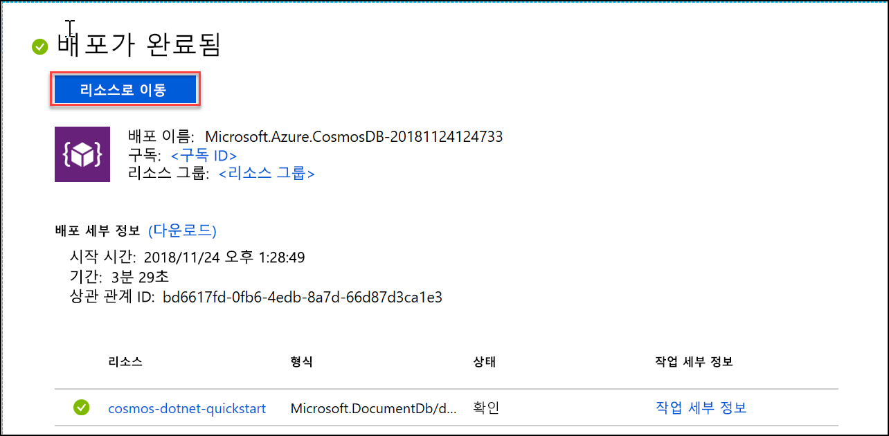

1. 새 브라우저 창에서 [Azure Portal](https://portal.azure.com/)에 로그인합니다.
2. **리소스 만들기** > **데이터베이스** > **Azure Cosmos DB**를 클릭합니다.
   
   

3. **Azure Cosmos DB 계정 만들기** 페이지에서 새 Azure Cosmos DB 계정에 대한 설정을 입력합니다. 
 
    설정|값|설명
    ---|---|---
    구독|*구독*|이 Azure Cosmos DB 계정에 사용하려는 Azure 구독을 선택합니다. 
    리소스 그룹|새로 만들기  *고유한 이름 입력*|**새로 만들기**를 선택하고 사용자 계정에 대한 새 리소스 그룹 이름을 입력합니다. 간단히 하기 위해 계정 이름과 동일한 이름을 사용할 수 있습니다. 
    계정 이름|*고유한 이름 입력*|내 Azure Cosmos DB 계정을 식별하는 고유한 이름을 입력합니다. URI를 만들기 위해 제공하는 ID에 *documents.azure.com*이 추가되므로 고유한 ID를 사용합니다.  ID는 소문자, 숫자 및 하이픈(-) 문자만 포함할 수 있으며, 3~31자여야 합니다.
    API|Core(SQL)|API는 만들 계정의 형식을 결정합니다. Azure Cosmos DB는 SQL(문서 데이터베이스), Gremlin(그래프 데이터베이스), MongoDB(문서 데이터베이스), Table API 및 Cassandra API라는 5가지 API를 제공합니다. 현재 각 API를 사용하려면 별도의 계정을 만들어야 합니다.   이 문서에서는 문서 데이터베이스를 만들고 SQL 구문을 사용하여 쿼리하므로 **Core(SQL)** 를 사용합니다.   [SQL API에 대한 자세한 정보](../articles/cosmos-db/documentdb-introduction.md)|
    위치|*사용자와 가장 가까운 지역 선택*|Azure Cosmos DB 계정을 호스트할 지리적 위치를 선택합니다. 데이터에 가장 빨리 액세스할 수 있도록 사용자와 가장 가까운 위치를 사용합니다.
    지리적 중복 사용| 비워 둠 | 그러면 두 번째(쌍을 이루는) 지역에서 복제된 버전의 데이터베이스를 만듭니다. 이 항목을 비워둡니다.  
    다중 지역 쓰기| 비워 둠 | 이를 사용하면 각 데이터베이스 영역은 읽기 및 쓰기 지역이 될 수 있습니다. 이 항목을 비워둡니다.  

    **검토 + 만들기**를 클릭합니다. **네트워크** 및 **태그** 섹션을 건너뛸 수 있습니다. 

    

    요약 정보를 검토하고 **만들기**를 클릭합니다. 

    

4. 계정 생성에는 몇 분 정도가 소요됩니다. 포털에 **배포가 완료됨** 메시지가 표시될 때까지 기다리고 **리소스로 이동**을 클릭합니다.     

    

5. 이제 포털에서 **축하합니다! Azure Cosmos DB 계정이 만들어졌습니다.** 페이지가 표시될 때까지 기다립니다.

    

