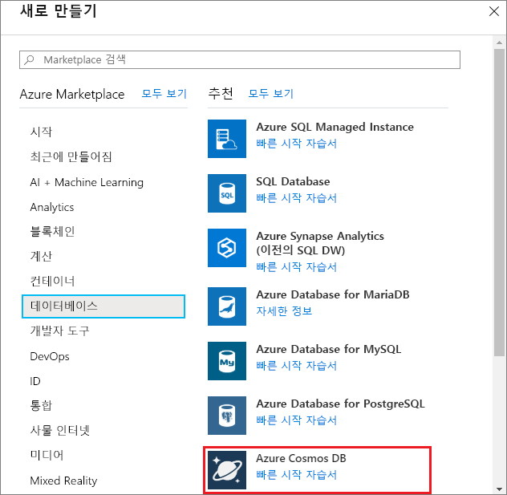
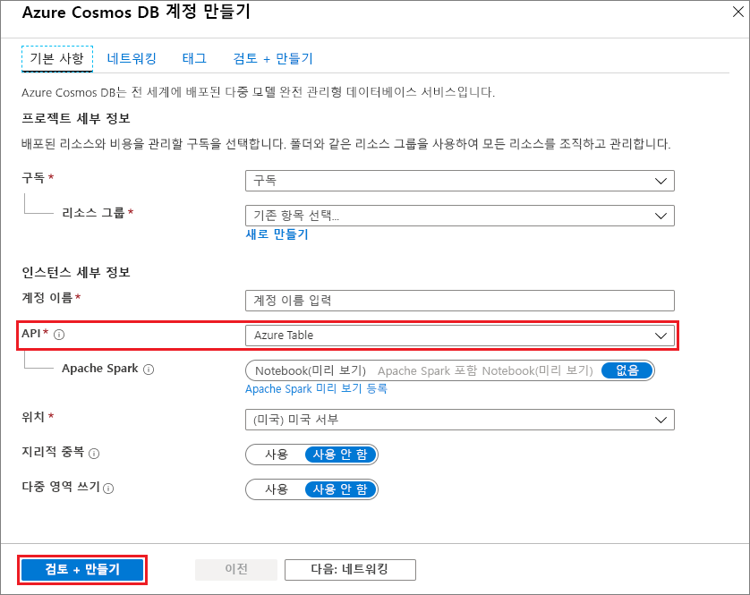
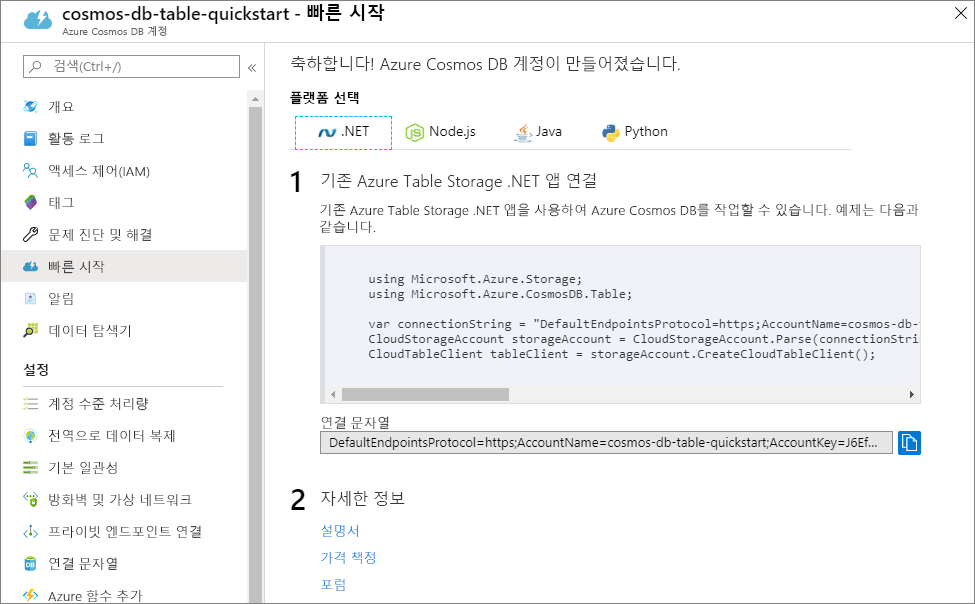

1. 새 브라우저 창에서 [Azure Portal](https://portal.azure.com/)에 로그인합니다.
2. 왼쪽 메뉴에서 **리소스 만들기**, **데이터베이스**를 차례로 클릭한 다음, **Azure Cosmos DB**에서 **만들기**를 클릭합니다. 
   
   

3. **새 계정** 페이지에서 새 Azure Cosmos DB 계정에 대한 설정을 입력합니다. 
 
    설정|제안 값|설명
    ---|---|---
    ID|*고유한 이름 입력*|이 Azure Cosmos DB 계정을 식별하는 고유한 이름을 입력합니다. URI를 만들기 위해 제공하는 ID에 *documents.azure.com*이 추가되므로 식별할 수 있는 고유한 ID를 사용합니다.  ID는 소문자, 숫자 및 하이픈(-) 문자만 포함할 수 있으며, 3-50자를 포함해야 합니다.
    API|Azure 테이블|API는 만들 계정의 형식을 결정합니다. Azure Cosmos DB는 응용 프로그램의 요구 사항을 충족하기 위해 SQL(문서 데이터베이스), Gremlin(그래프 데이터베이스), MongoDB(문서 데이터베이스), Azure Table 및 Cassandra라는 다섯 가지 API를 제공합니다. 현재 각각에는 별도의 계정이 필요합니다.  이 빠른 시작에서는 테이블 API를 사용하는 테이블을 만들 예정이므로 **Azure 테이블**을 선택합니다.  [테이블 API에 대한 자세한 정보](../articles/cosmos-db/table-introduction.md) |
    구독|*ID에서 위에 제공된 동일한 고유한 이름 입력*|이 Azure Cosmos DB 계정에 사용할 Azure 구독을 선택합니다. 
    리소스 그룹|새로 만들기  *그런 후 ID에서 위에 제공된 동일한 고유한 이름을 입력합니다*.|**새로 만들기**를 선택하고 사용자 계정에 대한 새 리소스 그룹 이름을 입력합니다. 간단히 하기 위해 ID와 동일한 이름을 사용할 수 있습니다.
    위치|*사용자와 가장 가까운 지역 선택*|Azure Cosmos DB 계정을 호스트할 지리적 위치를 선택합니다. 데이터에 가장 빨리 액세스할 수 있도록 사용자와 가장 가까운 위치를 사용합니다.
    지리적 중복 사용| 비워 둠 | 그러면 두 번째(쌍을 이루는) 지역에서 복제된 버전의 데이터베이스를 만듭니다. 이 항목을 비워둡니다.  
    대시보드에 고정 | 여기서 | 쉬운 액세스를 위해 새 데이터베이스 계정이 포털 대시보드에 추가되도록 이 상자를 선택합니다.

    그런 다음 **Create**를 클릭합니다.

    

4. 계정 생성에는 몇 분 정도가 소요됩니다. 포털에서 **축하합니다! Azure Cosmos DB 계정이 만들어졌습니다.** 페이지가 표시될 때까지 기다립니다.

    
