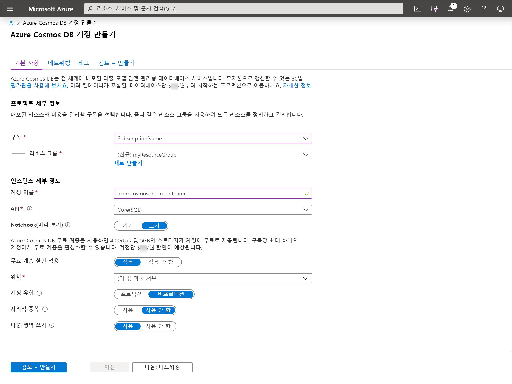

1. [Azure Portal](https://portal.azure.com/)로 이동하여 Azure Cosmos DB 계정을 만듭니다. **Azure Cosmos DB**를 검색하여 선택합니다.

   

1. **추가**를 선택합니다.
1. **Azure Cosmos DB 계정 만들기** 페이지에서 새 Azure Cosmos 계정에 대한 기본 설정을 입력합니다. 

    |설정|값|Description |
    |---|---|---|
    |Subscription|구독 이름|이 Azure Cosmos 계정에 사용하려는 Azure 구독을 선택합니다. |
    |리소스 그룹|리소스 그룹 이름|리소스 그룹을 선택하거나 **새로 만들기**를 선택한 후, 새 리소스 그룹에 고유한 이름을 입력합니다. |
    |계정 이름|고유한 이름|Azure Cosmos 계정을 식별하는 이름을 입력합니다. URI를 만들기 위해 제공하는 이름에 *documents.azure.com*이 추가되므로 고유한 이름을 사용합니다.  이름은 소문자, 숫자 및 하이픈(-) 문자만 포함할 수 있으며, 3~31자여야 합니다.|
    |API|만들 계정 형식|**Core(SQL)** 를 선택하여 문서 데이터베이스를 만들고 SQL 구문을 사용하여 쿼리합니다.   API는 만들 계정의 형식을 결정합니다. Azure Cosmos DB는 문서 데이터용 Core(SQL) 및 MongoDB, 그래프 데이터용 Gremlin, Azure Table 및 Cassandra, 이렇게 5가지 API를 제공합니다. 현재 각 API에 대한 별도의 계정을 만들어야 합니다.   [SQL API에 대한 자세한 정보](../articles/cosmos-db/documentdb-introduction.md)|
    |체험 계층 할인 적용|적용 또는 적용 안 함|Azure Cosmos DB 체험 계층을 사용하는 경우 처음에는 400RU/초 및 5GB의 스토리지가 계정에 무료로 제공됩니다. [체험 계층](https://azure.microsoft.com/pricing/details/cosmos-db/)에 대해 자세히 알아보세요.|
    |위치|사용자와 가장 가까운 지역|Azure Cosmos DB 계정을 호스트할 지리적 위치를 선택합니다. 데이터에 가장 빨리 액세스할 수 있도록 사용자와 가장 가까운 위치를 사용합니다.|
    |계정 유형|프로덕션 또는 비프로덕션|계정이 프로덕션 워크로드에 사용되는 경우 **프로덕션**을 선택합니다. 계정이 비프로덕션(예: 개발, 테스트, QA 또는 준비)에 사용되는 경우 **비프로덕션**을 선택합니다. 이는 포털 환경을 조정하지만 기본 Azure Cosmos DB 계정에는 영향을 주지 않는 Azure 리소스 태그 설정입니다. 이 값은 언제든지 변경할 수 있습니다.|

> [!NOTE]
> Azure 구독당 최대 1개의 체험 계층 Azure Cosmos DB 계정을 사용할 수 있으며 계정을 만들 때 옵트인해야 합니다. 체험 계층 할인을 적용하는 옵션이 표시되지 않으면 구독의 다른 계정에서 이미 체험 계층을 사용하도록 설정되었음을 의미합니다.
   
   

1. **검토 + 만들기**를 선택합니다. **네트워크** 및 **태그** 섹션은 건너뛰어도 됩니다.

1. 계정 설정을 검토한 다음, **만들기**를 선택합니다. 계정을 만드는 데 몇 분이 걸립니다. 포털 페이지에 **배포가 완료됨**이 표시되기를 기다립니다. 

    

1. **리소스로 이동**을 선택하여 Azure Cosmos DB 계정 페이지로 이동합니다. 

    
