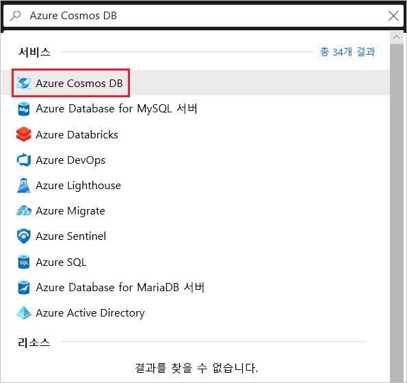
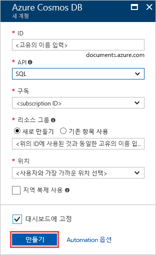
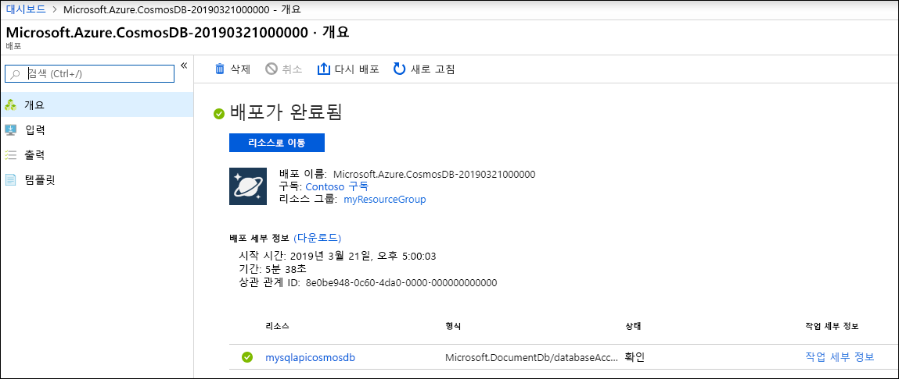
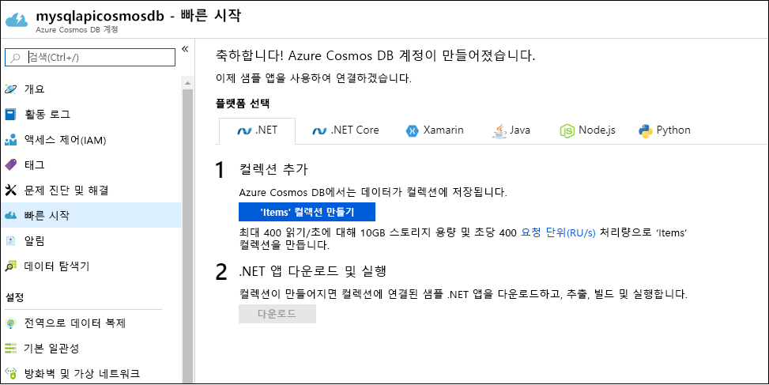

1. [Azure Portal](https://portal.azure.com/)에 로그인합니다.
1. **리소스 만들기** > **데이터베이스** > **Azure Cosmos DB**를 선택합니다.
   
   

1. **Azure Cosmos DB 계정 만들기** 페이지에서 새 Azure Cosmos 계정에 대한 기본 설정을 입력합니다. 
 
    |설정|값|설명 |
    |---|---|---|
    |구독|구독 이름|이 Azure Cosmos 계정에 사용하려는 Azure 구독을 선택합니다. |
    |리소스 그룹|리소스 그룹 이름|리소스 그룹을 선택하거나 **새로 만들기**를 선택한 후, 새 리소스 그룹에 고유한 이름을 입력합니다. |
    | 계정 이름|고유한 이름을 입력합니다.|Azure Cosmos 계정을 식별하는 이름을 입력합니다. URI를 만들기 위해 제공하는 ID에 *documents.azure.com*이 추가되므로 고유한 ID를 사용합니다.  ID는 소문자, 숫자 및 하이픈(-) 문자만 포함할 수 있으며, 3~31자여야 합니다.|
    | API|Core(SQL)|API는 만들 계정의 형식을 결정합니다. Azure Cosmos DB는 문서 데이터용 Core(SQL) 및 MongoDB, 그래프 데이터용 Gremlin, Azure Table 및 Cassandra, 이렇게 5가지 API를 제공합니다. 현재 각 API에 대한 별도의 계정을 만들어야 합니다.   **Core(SQL)** 를 선택하여 문서 데이터베이스를 만들고 SQL 구문을 사용하여 쿼리합니다.   [SQL API에 대한 자세한 정보](../articles/cosmos-db/documentdb-introduction.md)|
    | 위치|사용자와 가장 가까운 지역 선택|Azure Cosmos DB 계정을 호스트할 지리적 위치를 선택합니다. 데이터에 가장 빨리 액세스할 수 있도록 사용자와 가장 가까운 위치를 사용합니다.|
   
   

1. **검토 + 만들기**를 선택합니다. **네트워크** 및 **태그** 섹션은 건너뛰어도 됩니다. 

1. 계정 설정을 검토한 다음, **만들기**를 선택합니다. 계정을 만드는 데 몇 분이 걸립니다. 포털 페이지에 **배포가 완료됨**이 표시되기를 기다립니다. 

    

1. **리소스로 이동**을 선택하여 Azure Cosmos DB 계정 페이지로 이동합니다. 

    
