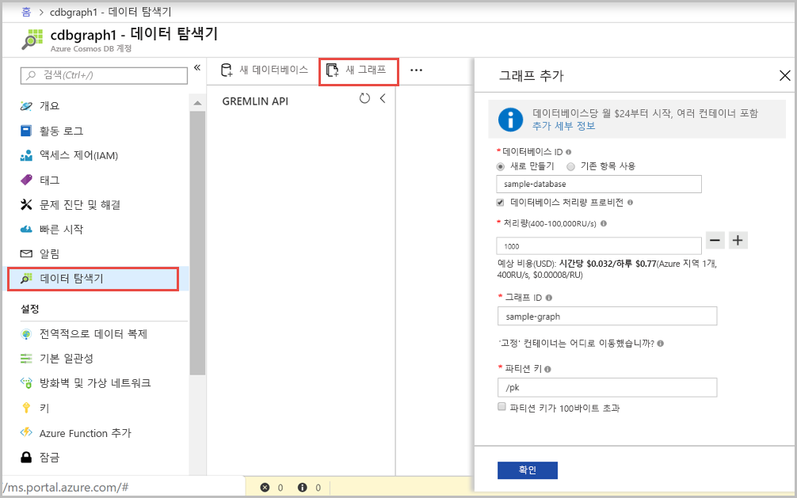

<!--Verify sucessfully-->
이제 Azure Portal에서 데이터 탐색기 도구를 사용하여 그래프 데이터베이스를 만들 수 있습니다. 

1. **데이터 탐색기** > **새 그래프**를 클릭합니다.

    **그래프 추가** 영역이 맨 오른쪽에 표시되면 확인하기 위해 오른쪽으로 스크롤해야 합니다.

    

2. **그래프 추가** 페이지에서 새 그래프에 대한 설정을 입력합니다.

    설정|제안 값|설명
    ---|---|---
    데이터베이스 ID|sample-database|새 데이터베이스의 이름으로 *sample-database*를 입력합니다. 데이터베이스 이름은 1~255자 사이여야 하며 `/ \ # ?` 또는 후행 공백을 포함할 수 없습니다.
    그래프 ID|sample-graph|새 컬렉션의 이름으로 *sample-graph*를 입력입니다. 그래프 이름은 데이터베이스 ID와 동일한 문자 요구 사항을 갖습니다.
    저장소 용량|고정(10GB)|기본값인 **고정(10GB)** 으로 둡니다. 이 값은 데이터베이스의 저장소 용량입니다.
    처리량|400RU|처리량을 400RU/s(초당 요청 단위)로 변경합니다. 대기 시간을 줄이면 나중에 처리량을 늘릴 수 있습니다.

3. 양식을 작성한 후 **확인**을 클릭합니다.

<!--Verify sucessfully-->
<!--Update_Description: new articles on  -->
<!--ms.date: 03/18/2019-->