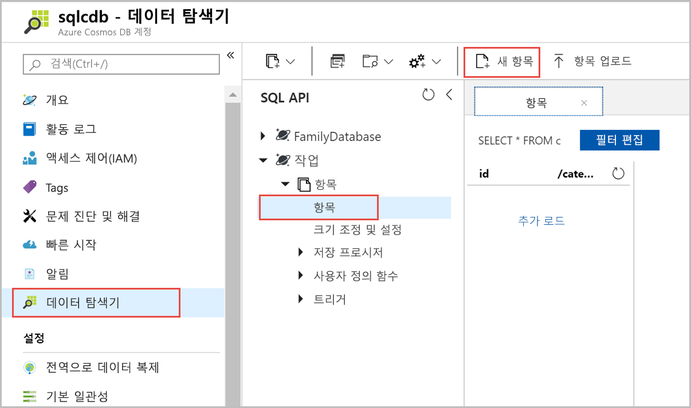
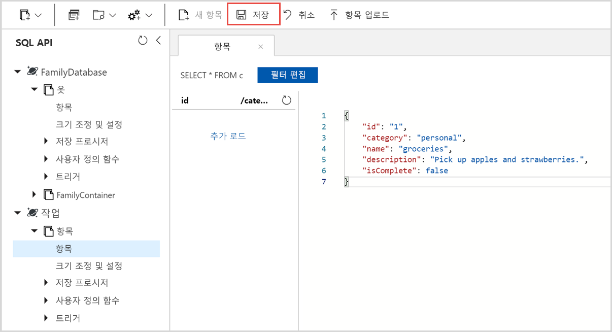

이제 데이터 탐색기를 사용하여 새 컬렉션에 데이터를 추가할 수 있습니다.

1. 데이터 탐색기에서 새 데이터베이스가 컬렉션 창에 나타납니다. **작업** 데이터베이스를 확장하고 **Items** 컬렉션을 확장하고 **문서**를 클릭한 후 **새 문서**를 클릭합니다. 

   
  
2. 이제 다음과 같은 구조를 사용하여 컬렉션에 문서를 추가 합니다.

     ```json
     {
         "id": "1",
         "category": "personal",
         "name": "groceries",
         "description": "Pick up apples and strawberries.",
         "isComplete": false
     }
     ```

3. **문서** 탭에 Json을 추가했으면 **저장**을 클릭합니다.

    

4.  `id` 속성에 대한 고유한 값을 삽입하는 경우 둘 이상의 문서를 만들고 저장하며 다른 속성을 적합하게 변경합니다. Azure Cosmos DB가 데이터에 어떠한 스키마도 적용하지 않으므로 새 문서는 사용자가 원하는 어떠한 구조든 가질 수 있습니다.