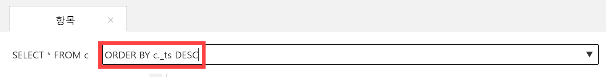
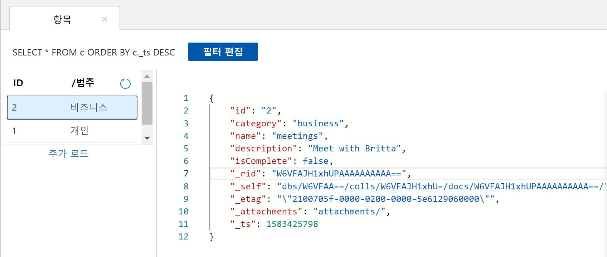

데이터 탐색기에서 쿼리를 사용하여 데이터를 검색하고 필터링할 수 있습니다.

1. 데이터 탐색기의 **문서** 탭 맨 위에서 기본 쿼리 `SELECT * FROM c`를 검토하세요. 이 쿼리는 컬렉션의 모든 문서를 검색하고 ID 순으로 표시합니다. 
   
   
   
1. 쿼리를 변경하려면 **필터 편집**을 선택하고 기본 쿼리를 `ORDER BY c._ts DESC`로 변경한 다음, **필터 적용**을 선택합니다.
   
   

   수정된 쿼리는 해당 타임스탬프에 따라 내림차순으로 문서를 표시합니다. 따라서 이제 두 번째 문서가 첫 번째로 나열됩니다. 
   
   

SQL 구문에 익숙한 경우 쿼리 조건자 상자에 지원되는 [SQL 쿼리](../articles/cosmos-db/sql-api-sql-query.md)를 입력할 수 있습니다. 데이터 탐색기를 사용하여 서버 쪽 비즈니스 논리에 대한 저장 프로시저, UDF 및 트리거를 만들 수도 있습니다. 

데이터 탐색기를 사용하면 API에 제공되는 모든 내장 프로그래밍 방식 데이터 액세스 기능에 대해 Azure Portal에서 간편하게 액세스할 수 있습니다. 포털을 사용하여 Azure Cosmos DB 계정에 대한 처리량을 조정하고 키와 연결 문자열을 가져오고, 메트릭과 SLA를 검토할 수 있습니다. 

