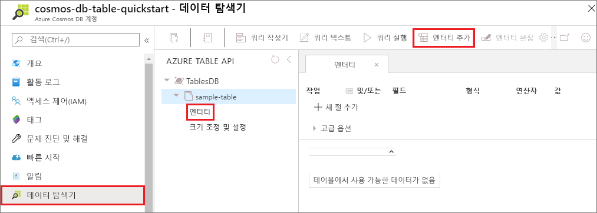
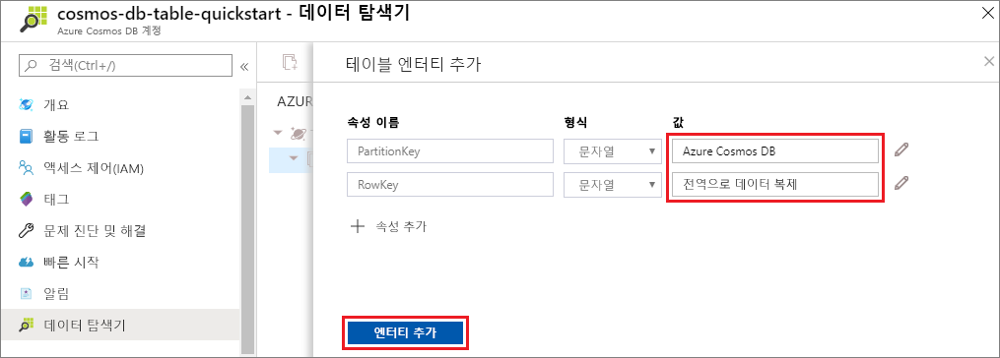

이제 데이터 탐색기를 사용하여 새 테이블에 데이터를 추가할 수 있습니다.

1. 데이터 탐색기에서 **sample-table**을 확장하고 **엔터티**를 선택한 다음, **엔터티 추가**를 선택합니다.

   

2. 이제 PartitionKey 값 상자 및 RowKey 값 상자에 데이터를 추가하고 **엔터티 추가**를 선택합니다.

   
  
    이제 테이블에 더 많은 엔터티를 추가하고 엔터티를 편집하거나 데이터 탐색기에서 데이터를 쿼리할 수 있습니다. 또한 데이터 탐색기에서는 처리량을 확장하고, 저장 프로시저, 사용자 정의 함수 및 트리거를 테이블에 추가할 수도 있습니다.