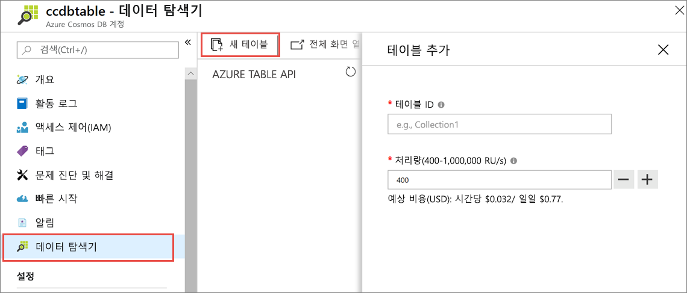
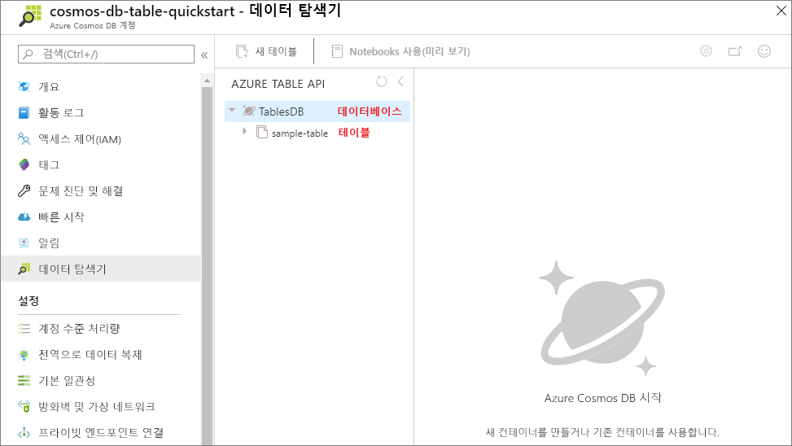

이제 Azure Portal에서 [데이터 탐색기] 도구를 사용하여 데이터베이스와 테이블을 만들 수 있습니다. 

1. **데이터 탐색기** > **새 테이블**을 차례로 클릭합니다. 
    
    **테이블 추가** 영역이 맨 오른쪽에 표시됩니다. 이 영역을 보기 위해 오른쪽으로 스크롤해야 할 수도 있습니다.

    

2. **테이블 추가** 페이지에서 새 테이블에 대한 설정을 입력합니다.

    설정|제안 값|설명
    ---|---|---
    테이블 ID|sample-table|새 테이블에 대한 ID입니다. 테이블 이름은 데이터베이스 ID와 동일한 문자 요구 사항을 갖습니다. 데이터베이스 이름은 1~255자 사이여야 하며 `/ \ # ?` 또는 후행 공백을 포함할 수 없습니다.
    처리량|400RU|처리량을 400RU/s(초당 요청 단위)로 변경합니다. 대기 시간을 줄이면 나중에 처리량을 늘릴 수 있습니다.

3. **확인**을 클릭합니다.

4. [데이터 탐색기]에서 새 데이터베이스와 테이블이 표시됩니다.

   