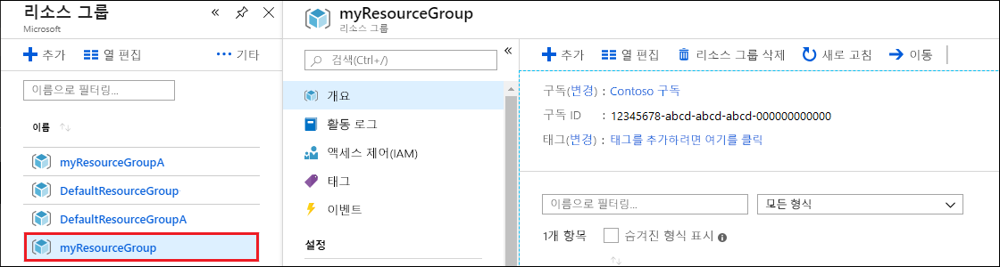
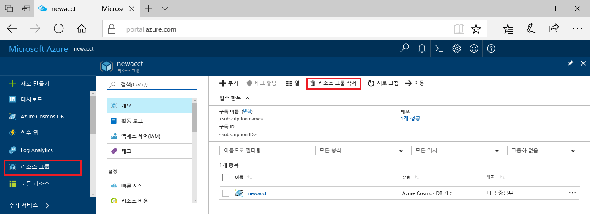

웹앱과 Azure Cosmos DB 계정을 모두 사용했으면 추가로 비용을 지불하지 않도록 만든 Azure 리소스를 삭제할 수 있습니다. 리소스를 삭제하려면:

1. Azure Portal의 맨 왼쪽에서 **리소스 그룹**을 선택합니다. 왼쪽 메뉴가 축소되어 있으면 을 선택하여 확장합니다.

2. 이 빠른 시작에서 만든 리소스 그룹을 선택합니다.  

    

2. 새 창에서 **리소스 그룹 삭제**를 선택합니다.

       

3. 새 창에서 삭제할 리소스 그룹의 이름을 입력한 다음, **삭제**를 선택합니다.