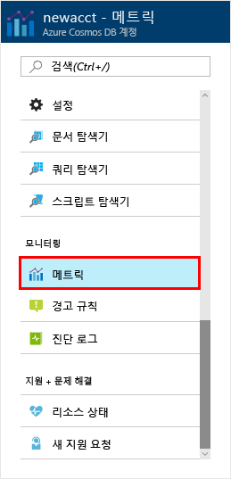
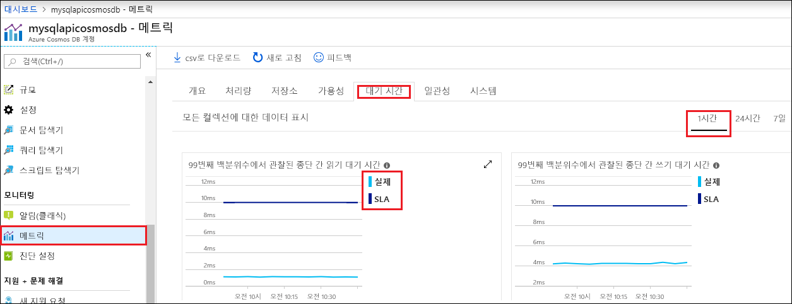

계정에 있는 리소스의 처리량, 저장소, 가용성, 대기 시간 및 일관성은 Azure Portal에서 모니터링됩니다. 이러한 메트릭을 빠르게 살펴보겠습니다. 

1. 탐색 메뉴에서 **메트릭** 을 클릭합니다.

   

2. Azure Cosmos DB에서 제공한 메트릭을 인식하도록 각 탭을 클릭합니다. 

    [Azure Cosmos DB SLA(서비스 수준 계약)](https://azure.microsoft.com/support/legal/sla/cosmos-db/)와 연결된 각 차트에서는 SLA가 손상되었는지를 표시하는 줄을 제공합니다. Azure Cosmos DB를 통해 메트릭의 이 도구 모음을 사용하여 투명하게 SLA를 모니터링할 수 있습니다. 

   