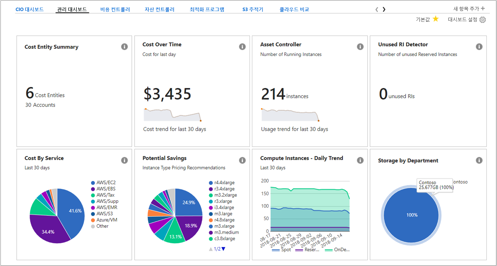
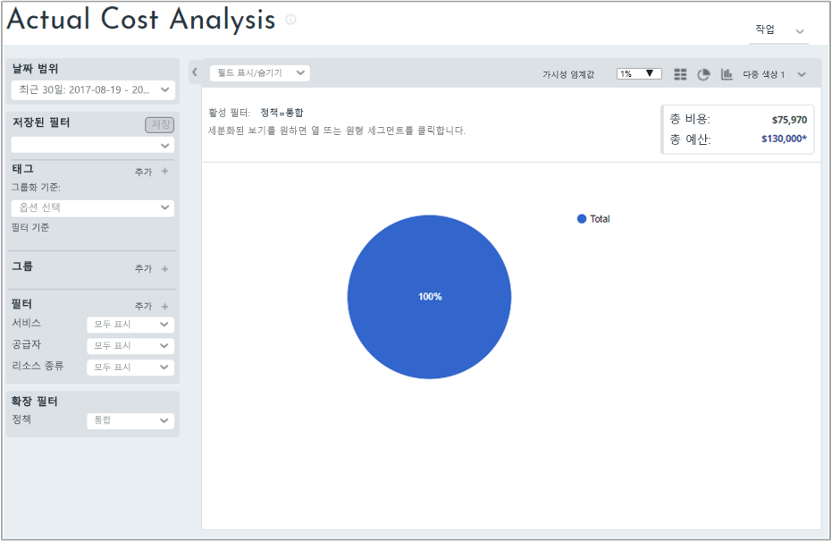
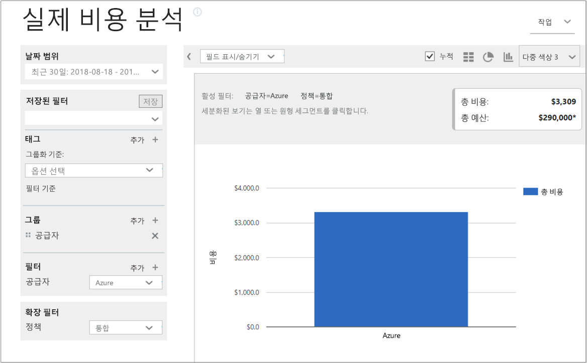
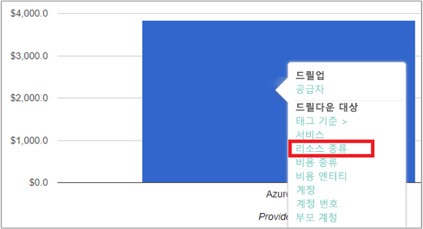
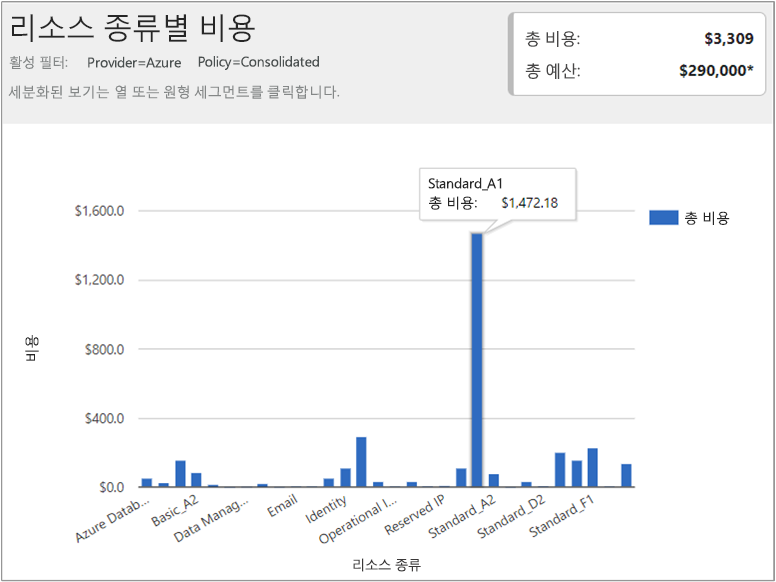
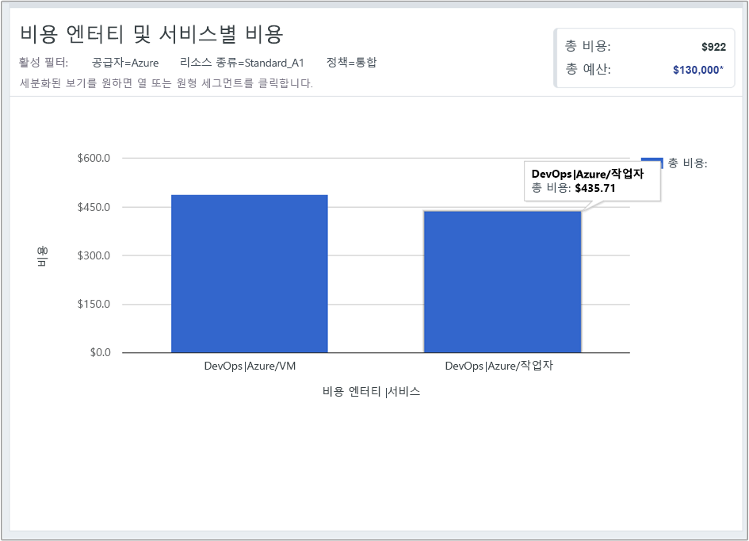

## 비용 데이터 보기

Azure Cost Management by Cloudyn에서는 모든 클라우드 리소스 데이터에 대한 액세스 권한을 제공합니다. 대시보드 보고서의 눌러진 보기에서 표준 및 사용자 지정 보고서를 모두 찾을 수 있습니다. 데이터의 비용을 즉시 보여주는 인기 있는 대시보드 및 보고서의 예제는 다음과 같습니다.

이 예제에서 관리 대시보드는 모든 클라우드 리소스에서 Contoso 비즈니스의 통합된 비용을 보여줍니다. Contoso는 Azure, AWS 및 Google을 사용합니다. 대시보드는 요약 정보를 제공하며 보고서로 이동하는 좋은 방법입니다.  

대시보드에서 보고서의 용도를 잘 모를 경우 **i** 기호 위로 마우스를 가져가서 설명을 확인합니다. 전체 보고서를 확인하려면 대시보드에서 보고서를 클릭합니다.

포털의 위쪽에 있는 보고서 메뉴를 사용하여 보고서를 볼 수 있습니다. 최근 30일 동안 사용한 Contoso의 Azure 리소스를 살펴보겠습니다. **비용** > **비용 분석** > **실제 비용 분석**을 클릭합니다. 보고서에서 태그, 그룹 또는 필터의 집합이 있는 경우 값의 선택을 취소합니다.

이 예제에서 $75,970는 총 비용이며 예산은 $130,000입니다.

이제 보고서 형식을 수정하고 Azure 비용에 대한 결과로 그룹 및 필터 범위를 좁혀서 설정하겠습니다. **날짜 범위**를 지난 30일로 설정합니다. 오른쪽 위에서 열 기호를 클릭하여 가로 막대형 차트로 형식을 지정하고 그룹 아래에서 **공급자**를 선택합니다. **공급자**의 필터를 **Azure**로 설정합니다.

이 예제에서 Azure 리소스의 총비용은 지난 30일 동안 $3,839입니다.

공급자(Azure) 표시줄을 마우스 오른쪽 단추로 클릭하고 **리소스 종류**를 드릴다운합니다.

다음 이미지에서는 Contoso가 발생한 Azure 리소스의 비용을 보여줍니다. 총비용은 $3,839였습니다. 이 예제에서 비용의 절반 정도가 로컬 중복 저장소에 사용되고 다른 절반의 비용이 다양한 VM 인스턴스에 사용되었습니다.

리소스 종류를 마우스 오른쪽 단추로 클릭하고 **비용 엔터티**를 선택하여 리소스를 사용한 비용 엔터티 및 서비스를 봅니다. DevOps의 VM 및 작업자 서비스는 이 예제에서 각각 $486.60과 $435.71을 사용했습니다. 두 항목의 총비용은 $922입니다.

클라우드 청구 데이터를 보는 방법에 대한 자습서 비디오를 시청하려면 [Cloudyn에서 개발한 Azure Cost Management를 사용하여 클라우드 청구 데이터 분석](https://youtu.be/G0pvI3iLH-Y)을 참조하세요.
