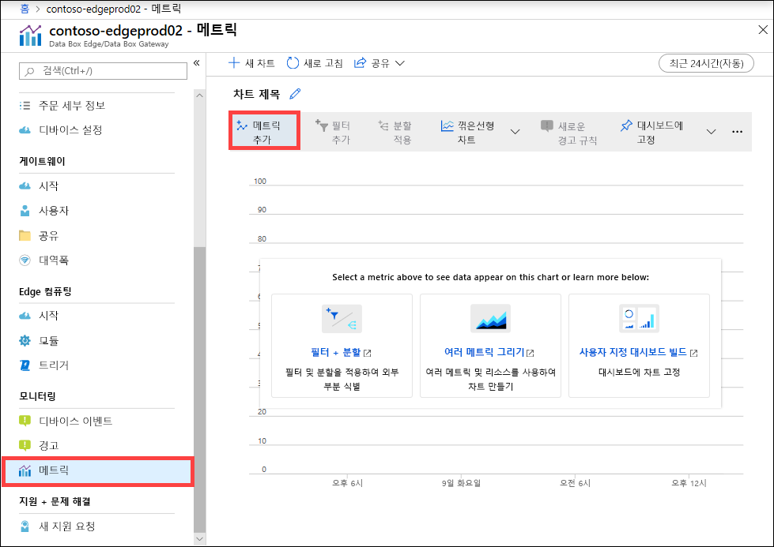
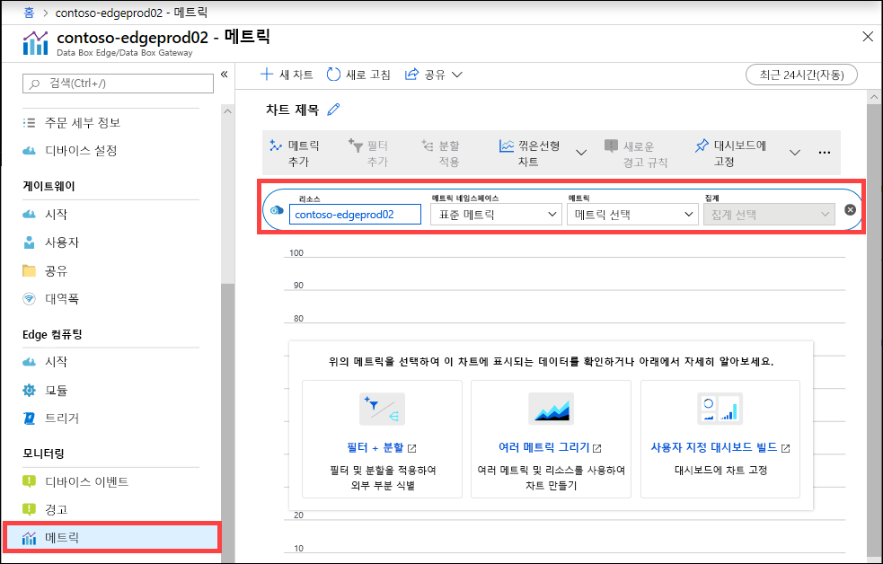
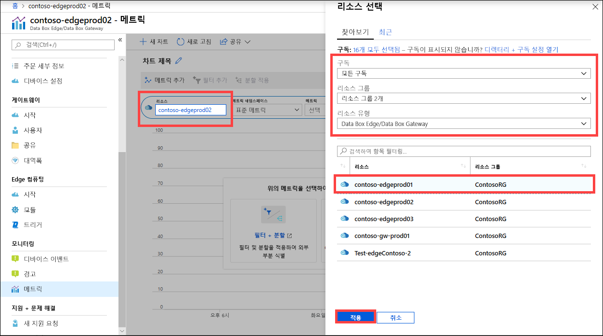
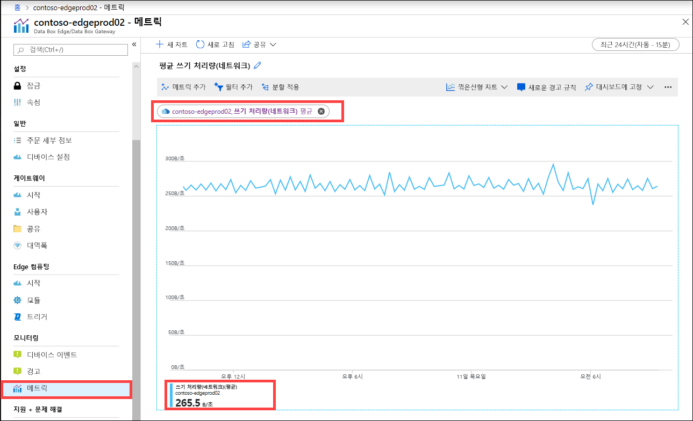
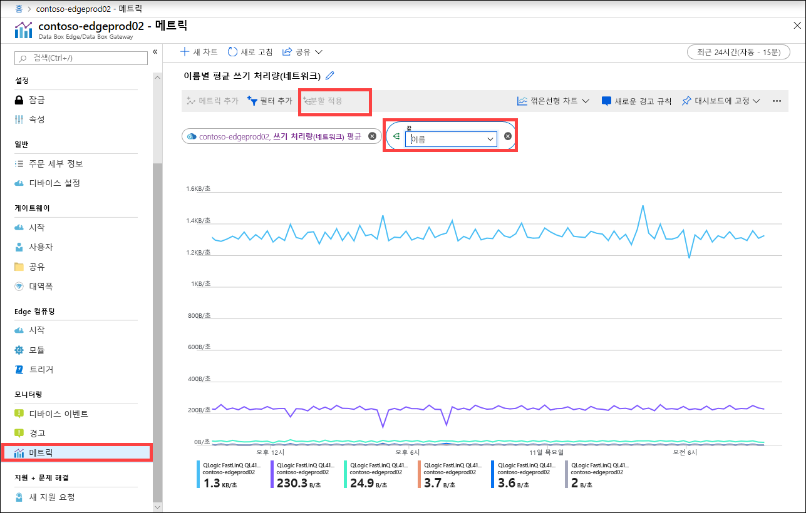

디바이스의 성능을 모니터링하거나 일부 인스턴스에서 디바이스 문제를 해결하기 위해 메트릭을 볼 수도 있습니다.

선택한 디바이스 메트릭에 대한 차트를 만들려면 Azure Portal에서 다음 단계를 수행합니다.

1. Azure Portal에 있는 리소스의 경우 **모니터링 > 메트릭**으로 차례로 이동하여  **메트릭 추가**를 선택합니다.

    

2. 리소스가 자동으로 채워집니다.  

    

    다른 리소스를 지정하려면 해당 리소스를 선택합니다.  **리소스 선택** 블레이드에서 메트릭을 표시하려는 구독, 리소스 그룹, 리소스 종류 및 특정 리소스를 선택하고 **적용**을 선택합니다.

    

3. 드롭다운 목록에서 디바이스를 모니터링할 메트릭을 선택합니다. 메트릭은 **용량 메트릭** 또는 **트랜잭션 메트릭**일 수 있습니다. 용량 메트릭은 디바이스의 용량과 관련이 있습니다. 트랜잭션 메트릭은 Azure Storage에 대한 읽기 및 쓰기 작업과 관련이 있습니다.

    |용량 메트릭                     |설명  |
    |-------------------------------------|-------------|
    |**사용 가능한 용량**               | 디바이스에 쓸 수 있는 데이터의 크기를 나타냅니다. 즉, 디바이스에서 사용할 수 있는 용량입니다.   디바이스와 클라우드 모두에 복사본이 있는 파일의 로컬 복사본을 삭제하면 디바이스 용량을 확보할 수 있습니다.        |
    |**총 용량**                   | 데이터를 쓸 디바이스의 총 바이트 수를 나타냅니다. 이를 로컬 캐시의 전체 크기라고도 합니다.    이제 데이터 디스크를 추가하여 기존 가상 디바이스의 용량을 늘릴 수 있습니다. VM에 대한 하이퍼바이저 관리를 통해 데이터 디스크를 추가한 다음, VM을 다시 시작합니다. 게이트웨이 디바이스의 로컬 스토리지 풀이 새로 추가된 데이터 디스크를 수용할 수 있도록 확장됩니다.   자세한 내용은 [Hyper-V 가상 머신용 하드 드라이브 추가](https://www.youtube.com/watch?v=EWdqUw9tTe4)로 이동하세요. |
    
    |트랜잭션 메트릭              | 설명         |
    |-------------------------------------|---------|
    |**클라우드 업로드 바이트 수(디바이스)**    | 디바이스의 모든 공유에 업로드된 모든 바이트의 합계입니다.        |
    |**클라우드 업로드 바이트 수(공유)**     | 공유당 업로드된 바이트 수입니다. 로컬 환경은 다음과 같은 시스템일 수 있습니다.    평균 - 공유당 업로드된 모든 바이트의 합계/공유 수    최대 - 공유에서 업로드된 최대 바이트 수   최소 - 공유에서 업로드된 최소 바이트 수      |
    |**클라우드 다운로드 처리량(공유)**| 공유당 다운로드된 바이트 수입니다. 로컬 환경은 다음과 같은 시스템일 수 있습니다.    평균 - 공유에서 읽거나 다운로드된 모든 바이트의 합계/공유 수    최대 - 공유에서 다운로드된 최대 바이트 수   최소 - 공유에서 다운로드된 최소 바이트 수  |
    |**클라우드 읽기 처리량**            | 디바이스의 모든 공유에 걸쳐 클라우드에서 읽은 모든 바이트의 합계입니다.     |
    |**클라우드 업로드 처리량**          | 디바이스의 모든 공유에 걸쳐 클라우드에 쓴 모든 바이트의 합계입니다.     |
    |**클라우드 업로드 처리량(공유)**  | 공유에서 클라우드에 쓴 모든 바이트 수의 합계/공유 수는 공유당 평균, 최대 및 최소입니다.      |
    |**읽기 처리량 (네트워크)**           | 클라우드에서 읽은 모든 바이트 수에 대한 시스템 네트워크 처리량이 포함됩니다. 이 보기에는 공유로 제한되지 않는 데이터가 포함될 수 있습니다.   분할하면 디바이스의 모든 네트워크 어댑터를 통한 트래픽이 표시됩니다. 여기에는 연결되거나 사용하도록 설정되지 않은 어댑터가 포함됩니다.      |
    |**쓰기 처리량 (네트워크)**       | 클라우드에 쓴 모든 바이트 수에 대한 시스템 네트워크 처리량이 포함됩니다. 이 보기에는 공유로 제한되지 않는 데이터가 포함될 수 있습니다.   분할하면 디바이스의 모든 네트워크 어댑터를 통한 트래픽이 표시됩니다. 여기에는 연결되거나 사용하도록 설정되지 않은 어댑터가 포함됩니다.          |
    |**Edge 컴퓨팅 - 메모리 사용량**      | 이 메트릭은 Data Box Gateway에 적용되지 않으므로 채워지지 않습니다.          |
    |**Edge 컴퓨팅 - CPU 사용률**    | 이 메트릭은 Data Box Gateway에 적용되지 않으므로 채워지지 않습니다.         |

4. 드롭다운 목록에서 메트릭이 선택되면 집계도 정의할 수 있습니다. 집계는 지정된 기간 동안 집계된 실제 값을 나타냅니다. 집계된 값은 평균, 최솟값 또는 최댓값이 될 수 있습니다. 평균, 최대 또는 최소에서 집계를 선택합니다.

    

5. 선택한 메트릭에 여러 인스턴스가 있으면 분할 옵션을 사용할 수 있습니다. **분할 적용**을 선택한 다음, 분석 결과를 확인하려는 값을 선택합니다.

    

6. 몇 가지 인스턴스에 대한 분석 결과만 확인하려면 이제 데이터를 필터링할 수 있습니다. 예를 들어 이 경우 디바이스에 연결된 두 개의 네트워크 인터페이스에 대한 네트워크 처리량만 확인하려면 이러한 인터페이스를 필터링할 수 있습니다. **필터 추가**를 선택하고, 필터링할 네트워크 인터페이스 이름을 지정합니다.

    

7. 차트를 대시보드에 고정하여 쉽게 액세스할 수도 있습니다.

    

8. 차트 데이터를 Excel 스프레드시트로 내보내거나 공유할 수 있는 차트에 대한 링크를 가져오려면 명령 모음에서 공유 옵션을 선택합니다.

    