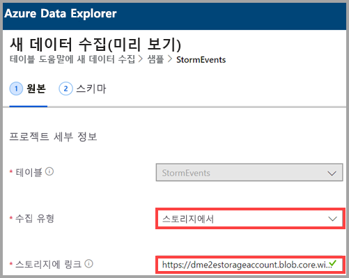
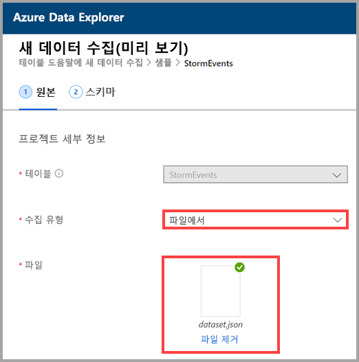
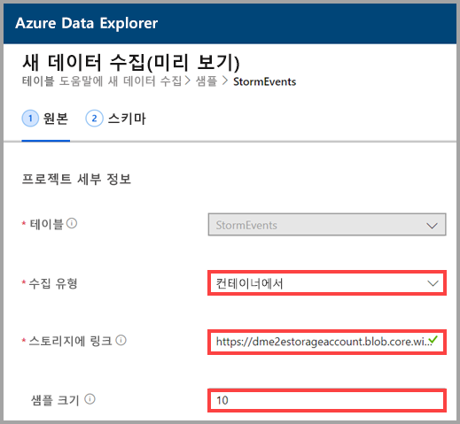
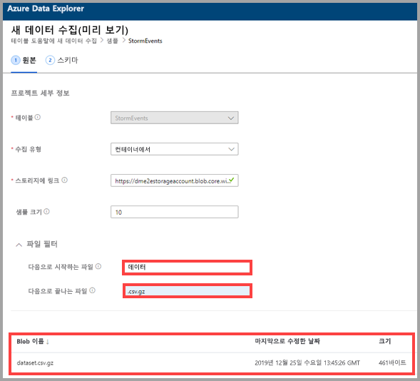

## 수집 유형 선택

**수집 유형**에 대해 다음 옵션 중 하나를 선택합니다.
   * **스토리지에서** - **스토리지에 연결** 필드에서 스토리지 계정의 URL을 추가합니다. 프라이빗 스토리지 계정에 [Blob SAS URL](/azurevs-azure-tools-storage-explorer-blobs#get-the-sas-for-a-blob-container)을 사용합니다.
   
      

    * **파일에서** - **찾아보기**를 선택하여 파일을 찾거나 파일을 필드로 끕니다.
  
      

    * **컨테이너에서** - **스토리지에 연결** 필드에서 컨테이너의 [SAS URL](/azure/vs-azure-tools-storage-explorer-blobs#get-the-sas-for-a-blob-container)을 추가하고 필요에 따라 샘플 크기를 입력합니다.

      

  데이터 샘플이 표시됩니다. 원하는 경우 특정 문자로 끝나는 파일만 표시하도록 필터링할 수 있습니다. 필터를 조정하면 미리 보기가 자동으로 업데이트됩니다.
  
  예를 들어 *data* 단어로 시작하고 *.csv.gz* 확장명으로 끝나는 모든 파일을 필터링할 수 있습니다.

  
