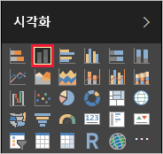
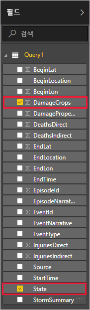
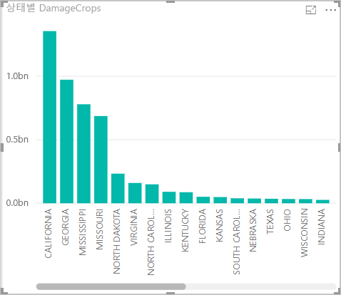

Power BI Desktop에 데이터가 있으므로 해당 데이터를 기준으로 보고서를 만들 수 있습니다. 주별 농작물 피해를 표시하는 세로 막대형 차트를 포함하는 간단한 보고서를 만듭니다.

1. 주 Power BI 창의 왼쪽에서 보고서 뷰를 선택합니다.

    

1. **시각화** 창에서 묶은 세로 막대형 차트를 선택합니다.

    

    빈 차트가 캔버스에 추가됩니다.

    

1. **필드** 목록에서 **DamageCrops** 및 **State**를 차례로 선택합니다.

    

    이제 테이블에 상위 1000개 행에 대한 농작물 피해를 보여 주는 차트가 표시됩니다.

    

1. 보고서를 저장합니다.