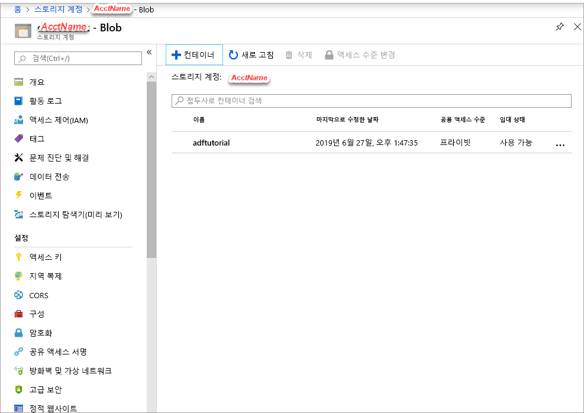

## <a name="prerequisites"></a>필수 조건

### <a name="azure-subscription"></a>Azure 구독
Azure 구독이 아직 없는 경우 시작하기 전에 [체험 계정](https://azure.microsoft.com/free/)을 만듭니다.

### <a name="azure-roles"></a>Azure 역할
데이터 팩터리 인스턴스를 만들려면 Azure에 로그인하는 데 사용할 사용자 계정이 *참여자* 또는 *소유자* 역할의 구성원이거나, Azure 구독의 *관리자*여야 합니다. 구독에 있는 권한을 보려면 [Azure portal](https://portal.azure.com)로 이동하고 오른쪽 위 모서리에 있는 사용자 이름을 선택한 다음, **추가 옵션**(...), **내 권한**을 선택합니다. 여러 구독에 액세스할 수 있는 경우 적절한 구독을 선택합니다.

데이터 세트, 연결된 서비스, 파이프라인, 트리거 및 통합 런타임을 포함하여 Data Factory에 대한 자식 리소스를 만들고 관리하려면 다음 요구 사항을 적용해야 합니다.

- Azure Portal에서 자식 리소스를 만들고 관리하려면 리소스 그룹 수준 이상의 **Data Factory 기여자** 역할에 속해야 합니다.
- PowerShell 또는 SDK를 사용하여 자식 리소스를 만들고 관리하려면 리소스 수준 이상의 **기여자** 역할만으로도 충분합니다.

사용자를 역할에 추가하는 방법에 대한 지침 샘플은 [역할 추가](../articles/billing/billing-add-change-azure-subscription-administrator.md) 문서를 참조하세요.

자세한 내용은 다음 문서를 참조하세요.

- [Data Factory 기여자 역할](../articles/role-based-access-control/built-in-roles.md#data-factory-contributor)
- [Azure Data Factory에 대한 역할 및 권한](../articles/data-factory/concepts-roles-permissions.md)

### <a name="azure-storage-account"></a>Azure Storage 계정
이 빠른 시작에서는 범용 Azure 스토리지 계정(특히 Blob Storage)을 *원본* 및 *대상* 데이터 스토리지로 사용합니다. 범용 Azure Storage 계정이 없는 경우 [스토리지 계정 만들기](../articles/storage/common/storage-quickstart-create-account.md)를 참조하여 새로 만듭니다. 

#### <a name="get-the-storage-account-name"></a>스토리지 계정 이름 가져오기
이 빠른 시작에서는 Azure 스토리지 계정의 이름이 필요합니다. 다음 프로시저에서는 스토리지 계정 이름을 가져오는 단계를 제공합니다. 

1. 웹 브라우저에서 [Azure Portal](https://portal.azure.com)로 이동하고 Azure 사용자 이름 및 암호를 사용하여 로그인합니다.
2. Azure Portal 메뉴에서 **모든 서비스**를 선택한 다음, **스토리지** > **스토리지 계정**을 선택합니다. 모든 페이지에서 *스토리지 계정*을 검색하여 선택할 수도 있습니다.
3. **스토리지 계정** 페이지에서 스토리지 계정(필요한 경우)을 필터링한 다음, 사용자의 스토리지 계정을 선택합니다. 

모든 페이지에서 *스토리지 계정*을 검색하여 선택할 수도 있습니다.

#### <a name="create-a-blob-container"></a>Blob 컨테이너 만들기
이 섹션에서는 Azure Blob Storage에 **adftutorial**이라는 Blob 컨테이너를 만듭니다.

1. 스토리지 계정 페이지에서 **개요** > **Blob**을 선택합니다.
2. *\<Account name>*  - **Blob** 페이지의 도구 모음에서 **컨테이너**를 선택합니다.
3. **새 컨테이너** 대화 상자에서 **adftutorial**을 이름으로 입력한 다음 **확인**을 선택합니다. *\<Account name>*  - **Blob** 페이지가 컨테이너 목록에 **adftutorial**을 포함하도록 업데이트됩니다.

   

#### <a name="add-an-input-folder-and-file-for-the-blob-container"></a>Blob 컨테이너에 대한 입력 폴더 및 파일 추가
이 섹션에서는 방금 만든 컨테이너에 **입력**이라는 폴더를 만든 다음, 입력 폴더에 샘플 파일을 업로드합니다. 시작하기 전에 **메모장**과 같은 텍스트 편집기를 열고 다음 내용을 사용하여 **emp.txt**라는 파일을 만듭니다.

```emp.txt
John, Doe
Jane, Doe
```

**C:\ADFv2QuickStartPSH** 폴더에 이 파일을 저장합니다. 이 폴더가 아직 없으면 만듭니다. 그런 후 Azure Portal로 돌아가 다음 단계를 따릅니다.

1. 작업을 중단했던 *\<Account name>*  - **Blob** 페이지의 업데이트된 컨테이너 목록에서 **adftutorial**을 선택합니다.

   1. 창을 닫거나 다른 페이지로 이동한 경우 [Azure Portal](https://portal.azure.com)에 다시 로그인합니다.
   1. Azure Portal 메뉴에서 **모든 서비스**를 선택한 다음, **스토리지** > **스토리지 계정**을 선택합니다. 모든 페이지에서 *스토리지 계정*을 검색하여 선택할 수도 있습니다.
   1. 스토리지 계정을 선택한 다음, **Blobs** > **adftutorial**을 선택합니다.

2. **adftutorial** 컨테이너 페이지의 도구 모음에서 **업로드**를 선택합니다.
3. **Blob 업로드** 페이지에서 **파일** 상자를 선택한 다음, **emp.txt** 파일을 선택합니다.
4. **고급** 제목을 펼칩니다. 이제 페이지가 다음과 같이 표시됩니다.

   
5. **폴더에 업로드** 상자에서 **입력**을 입력합니다.
6. **업데이트** 단추를 선택합니다. 목록에서 **emp.txt** 파일 및 업로드 상태를 참조하세요.
7. **닫기** 아이콘(**X**)을 선택하여 **Blob 업로드** 페이지를 닫습니다.

**adftutorial** 컨테이너 페이지를 열린 상태로 둡니다. 이 빠른 시작의 끝부분에서 출력을 확인하는 데 사용합니다.