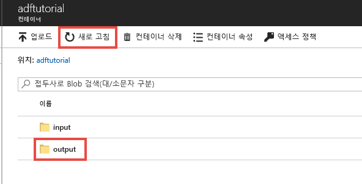
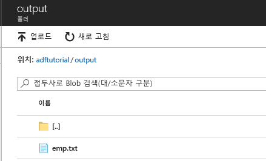

## <a name="verify-the-output"></a>출력 확인
파이프라인은 자동으로 adftutorial Blob 컨테이너에서 출력 폴더를 만듭니다. 그런 다음 입력 폴더에서 출력 폴더로 emp.txt 파일을 복사합니다. 

1. Azure Portal의 **adftutorial** 컨테이너 페이지에서 출력 폴더를 보려면 **새로 고침**을 클릭합니다. 
    
    
2. 폴더 목록에서 **출력**을 클릭합니다. 
2. **emp.txt**가 출력 폴더에 복사되었는지 확인합니다. 

    

## <a name="clean-up-resources"></a>리소스 정리
빠른 시작에서 만든 리소스는 두 가지 방법으로 정리할 수 있습니다. 리소스 그룹의 모든 리소스를 포함하고 있는 [Azure 리소스 그룹](../articles/azure-resource-manager/resource-group-overview.md)을 삭제할 수 있습니다. 다른 리소스를 그대로 유지하려면 이 자습서에서 만든 데이터 팩터리만 삭제합니다.

리소스 그룹을 삭제하면 그 안에 포함된 데이터 팩터리를 포함한 모든 리소스가 삭제됩니다. 다음 명령을 실행하여 전체 리소스 그룹을 삭제합니다. 
```powershell
Remove-AzResourceGroup -ResourceGroupName $resourcegroupname
```

참고: 리소스 그룹 삭제는 약간의 시간이 걸릴 수 있습니다. 프로세스에 대해 조금 기다려 주십시오

전체 리소스 그룹이 아니라 데이터 팩터리만 삭제하려면 다음 명령을 실행 합니다. 

```powershell
Remove-AzDataFactoryV2 -Name $dataFactoryName -ResourceGroupName $resourceGroupName
```