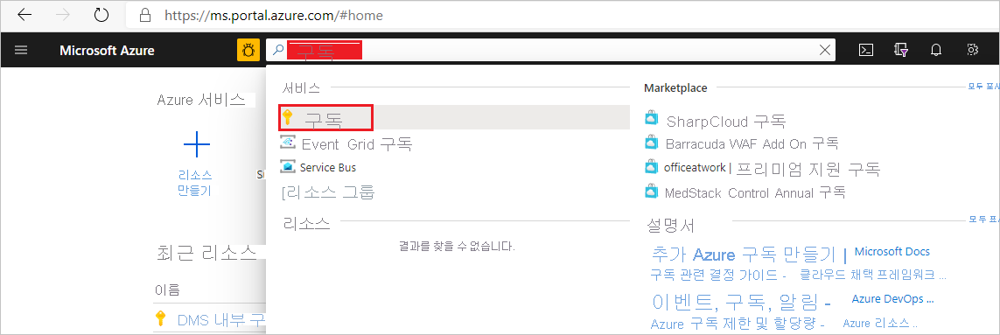

## Microsoft.DataMigration 리소스 공급자 등록

1. Azure Portal에 로그인합니다. **구독** 을 검색하여 선택합니다.

   

2. Azure Database Migration Service의 인스턴스를 만들 구독을 선택한 다음, **리소스 공급자** 를 선택합니다.

    

3. 마이그레이션을 검색한 다음, **Microsoft.DataMigration** 에 대해 **등록** 을 선택합니다.

        
