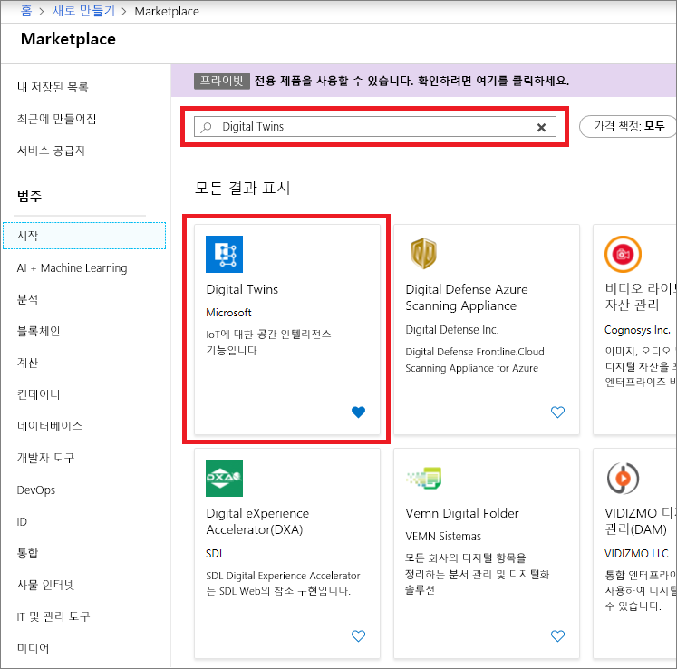
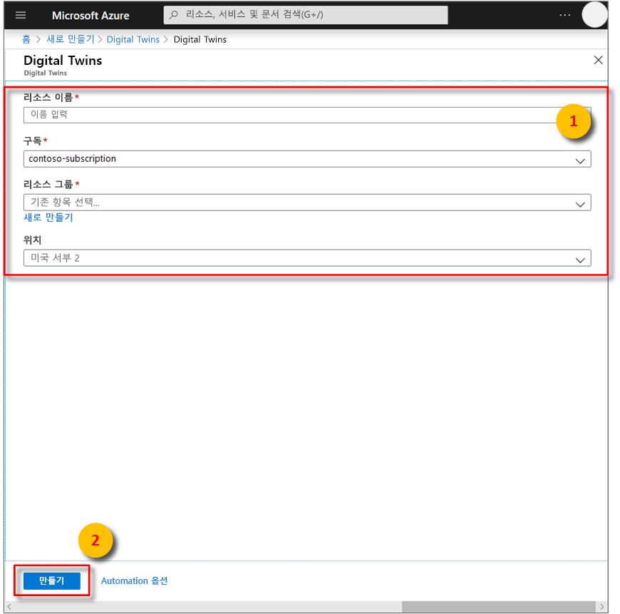
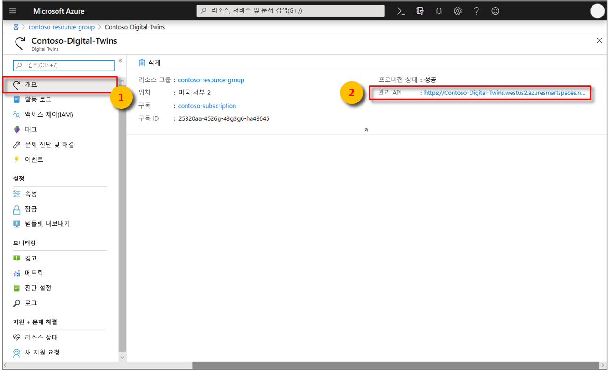

1. [Azure Portal](http://portal.azure.com)에 로그인합니다.

1. 왼쪽 탐색 창에서 **리소스 만들기**를 클릭합니다. *digital twins*를 검색하여 **Digital Twins(미리 보기)** 를 선택합니다. **만들기** 를 클릭하여 배포 프로세스를 시작합니다.

    

1. **Digital Twins** 창에서 다음 정보를 입력합니다.
   * **리소스 이름**: Digital Twins 인스턴스의 고유한 이름을 만듭니다.
   * **구독**: 이 Digital Twins 인스턴스를 만드는 데 사용할 구독을 선택합니다. 
   * **리소스 그룹**: Digital Twins 인스턴스에 대한 [리소스 그룹](https://docs.microsoft.com/azure/azure-resource-manager/resource-group-overview#resource-groups)을 선택하거나 만듭니다.
   * **위치**: 장치와 가장 가까운 위치를 선택합니다.

    

1. Digital Twins 정보를 검토한 다음, **만들기**를 클릭합니다. Digital Twins 인스턴스가 만들어질 때까지 몇 분 정도 걸릴 수 있습니다. **알림** 창에서 진행 상황을 모니터링할 수 있습니다.

1. Digital Twins 인스턴스의 **개요** 창을 엽니다. **관리 API** 아래에 링크가 나타납니다.

    1. **관리 API** URL은 **_https://yourDigitalTwinsName.yourLocation.azuresmartspaces.net/management/swagger_** 형식입니다. 이 URL은 인스턴스에 적용되는 Azure Digital Twins REST API 설명서로 이동합니다. [Azure Digital Twins Swagger 사용 방법](../articles/digital-twins/how-to-use-swagger.md)을 읽고 이 API 설명서를 읽고 사용하는 방법을 알아봅니다.

    1. **관리 API** URL을 **_https://yourDigitalTwinsName.yourLocation.azuresmartspaces.net/management/api/v1.0/_** 형식으로 수정합니다. 응용 프로그램은 수정된 URL을 기본 URL로 사용하여 인스턴스 액세스합니다. 수정된 이 URL을 임시 파일에 복사합니다. 이후 섹션에서 필요합니다.

    