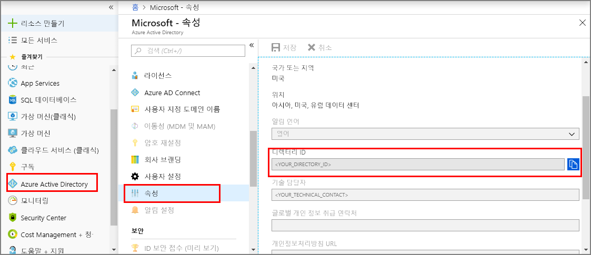
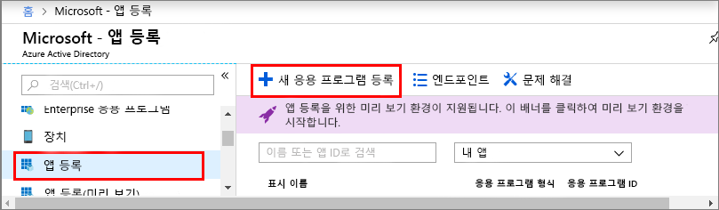
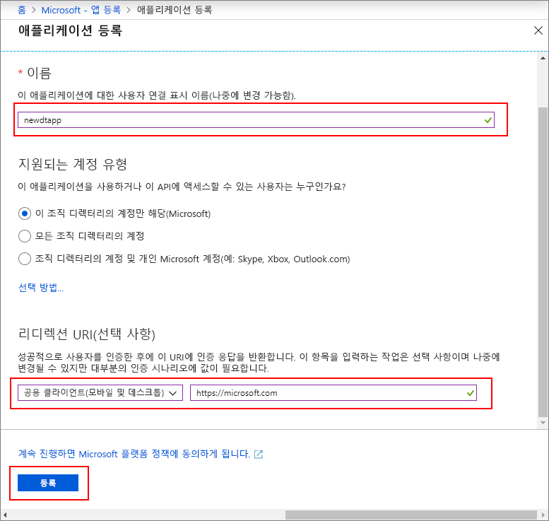
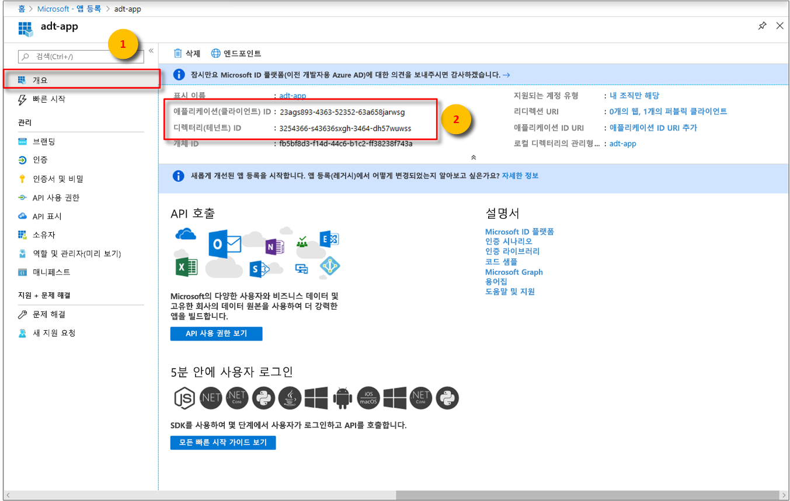

1. [Azure Portal](https://portal.azure.com)의 왼쪽 창에서 **Azure Active Directory**를 연 다음, **속성** 창을 엽니다. **디렉터리 ID**를 임시 파일에 복사합니다. 이 값은 다음 섹션에서 샘플 애플리케이션을 구성하는 데 사용됩니다.

    

1. **앱 등록** 창을 열고 **새 애플리케이션 등록** 단추를 선택합니다.

    

1. **이름** 상자에 이 앱 등록의 이름을 입력합니다. **애플리케이션 유형**으로 **네이티브**를 선택하고, **리디렉션 URI**로 `https://microsoft.com`을 선택합니다. **만들기**를 선택합니다.

    

1. 등록된 앱을 열고, **애플리케이션 ID** 필드의 값을 임시 파일에 복사합니다. 이 값은 Azure Active Directory 앱을 식별합니다. 애플리케이션 ID는 다음 섹션에서 샘플 애플리케이션을 구성하는 데 사용됩니다.

    

1. 앱 등록 창을 엽니다. **설정** > **필수 사용 권한**을 선택하고 다음 작업을 수행합니다.

   a. 왼쪽 위에서 **추가**를 선택하여 **API 액세스 추가** 창을 엽니다.

   b. **API 선택**을 선택하고 **Azure Digital Twins**를 검색합니다. 검색에서 API를 찾을 수 없는 경우 **Azure Smart Spaces**을 대신 검색합니다.

   다. **Azure Digital Twins(Azure Smart Spaces 서비스)** 옵션을 선택하고 **선택**을 선택합니다.

   d. **권한 선택**을 선택합니다. **읽기/쓰기 액세스** 위임된 권한 확인란을 선택하고 **선택**을 클릭합니다.

   e. **API 액세스 추가** 창에서 **완료**를 선택합니다.

   f. **필요한 권한** 창에서 **권한 부여** 단추를 선택하고, 나타나는 확인 메시지를 수락합니다.

      
