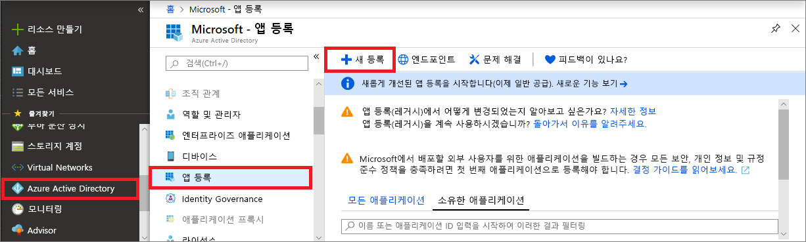
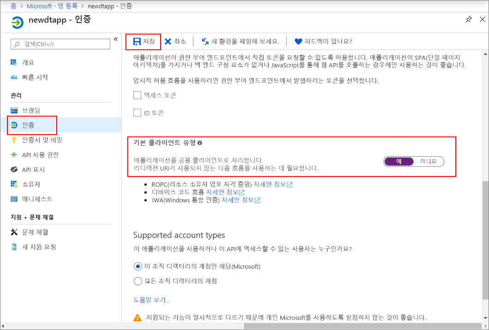
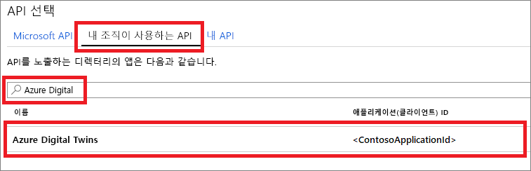
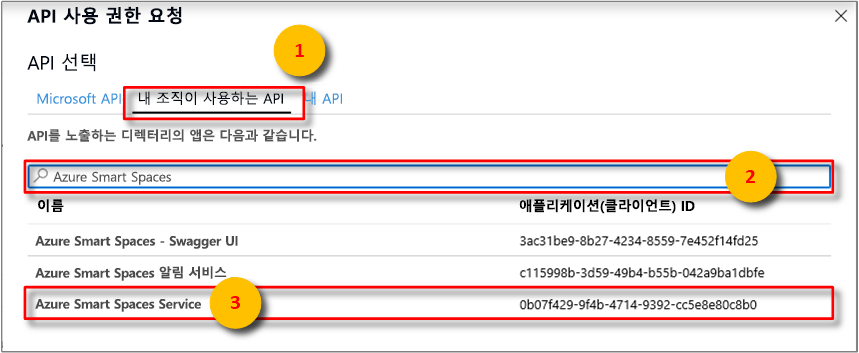
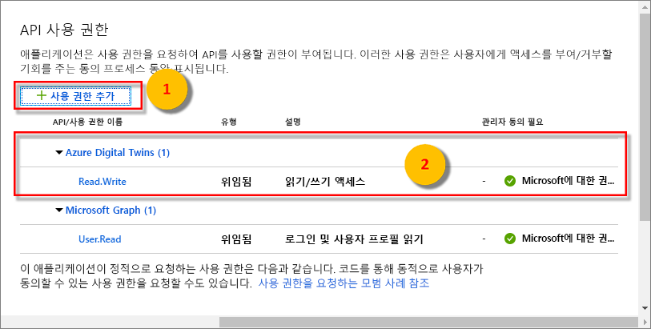

>[!NOTE]
>이 섹션에서는 [새 Azure AD 앱 등록](https://docs.microsoft.com/azure/active-directory/develop/quickstart-register-app)을 위한 지침을 제공합니다. 레거시 네이티브 앱 등록이 아직 있는 경우 지원되는 한 사용할 수 있습니다. 또한 어떤 이유로든 새로운 앱 등록 방법이 설정에서 작동하지 않는 경우 레거시 네이티브 AAD 앱을 만들어 볼 수 있습니다. 자세한 지침은 [Azure Active Directory 레거시로 Azure Digital Twins 앱 등록](../articles/digital-twins/how-to-use-legacy-aad.md)을 읽어보세요. 

1. [Azure Portal](https://portal.azure.com)의 왼쪽 창에서 **Azure Active Directory**를 연 다음, **앱 등록** 창을 엽니다. **새 등록** 단추를 선택합니다.

    

1. **이름** 상자에 이 앱 등록의 이름을 입력합니다. **리디렉션 URI(선택 사항)** 섹션의 왼쪽 드롭다운에서 **공용 클라이언트(모바일 및 데스크톱)** 를 선택하고 오른쪽 텍스트 상자에 `https://microsoft.com`을 입력합니다. **등록**을 선택합니다.

    

1. [앱이 *네이티브 앱*으로 등록되었는지](https://docs.microsoft.com/azure/active-directory/develop/scenario-desktop-app-registration) 확인하려면 앱 등록을 위한 **인증** 창을 열고 해당 창에서 아래로 스크롤합니다. **기본 클라이언트 유형** 섹션에서 **공용 클라이언트로 애플리케이션 처리**에 **예**를 선택합니다. 

    

1.  등록된 앱의 **개요** 창을 열고 임시 파일에 다음 엔터티의 값을 복사합니다. 이러한 값을 사용하여 다음 섹션에서 샘플 애플리케이션을 구성할 수 있습니다.

    - **애플리케이션(클라이언트) ID**
    - **디렉터리(테넌트) ID**

    

1. 앱 등록을 위한 **API 사용 권한** 창을 엽니다. **사용 권한 추가** 단추를 선택합니다. **API 사용 권한 요청** 창에서 **내 조직이 사용하는 API** 탭을 선택한 후, 다음을 검색합니다.
    
    1. `Azure Digital Twins`. **Azure Digital Twins** API를 선택합니다.

        

    1. 또는 `Azure Smart Spaces Service`를 검색합니다. **Azure 스마트 공간 서비스** API를 선택합니다.

        

    > [!IMPORTANT]
    > 표시되는 Azure AD API 이름 및 ID는 테넌트에 따라 다릅니다.
    > * 테스트 테넌트 및 고객 계정은 `Azure Digital Twins`를 검색해야 합니다.
    > * 다른 Microsoft 계정은 `Azure Smart Spaces Service`를 검색해야 합니다.

1. 동일한 **API 사용 권한 요청** 창에 선택한 API가 **Azure Digital Twins**로 표시됩니다. **읽기(1)** 드롭다운을 선택한 다음, **Read.Write** 확인란을 선택합니다. **사용 권한 추가** 단추를 선택합니다.

    

1. 조직의 설정에 따라 이 API에 대한 관리자 액세스 권한을 부여하려면 추가 단계를 수행해야 할 수도 있습니다. 자세한 내용은 관리자에게 문의하세요. 관리자 액세스가 승인되면 **API 사용 권한** 창의 **관리자 동의 필요** 열이 API에 대해 다음과 유사하게 표시됩니다.

    

