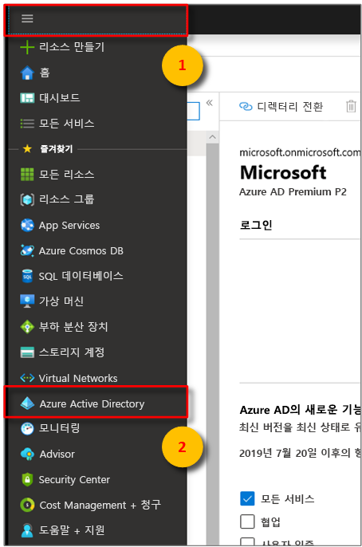
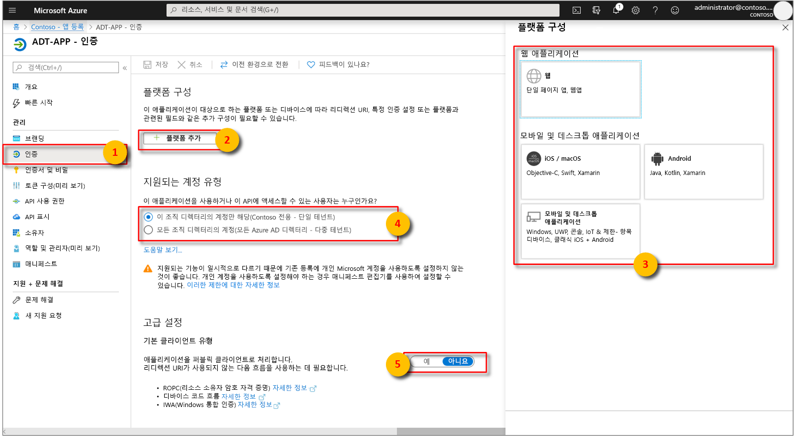
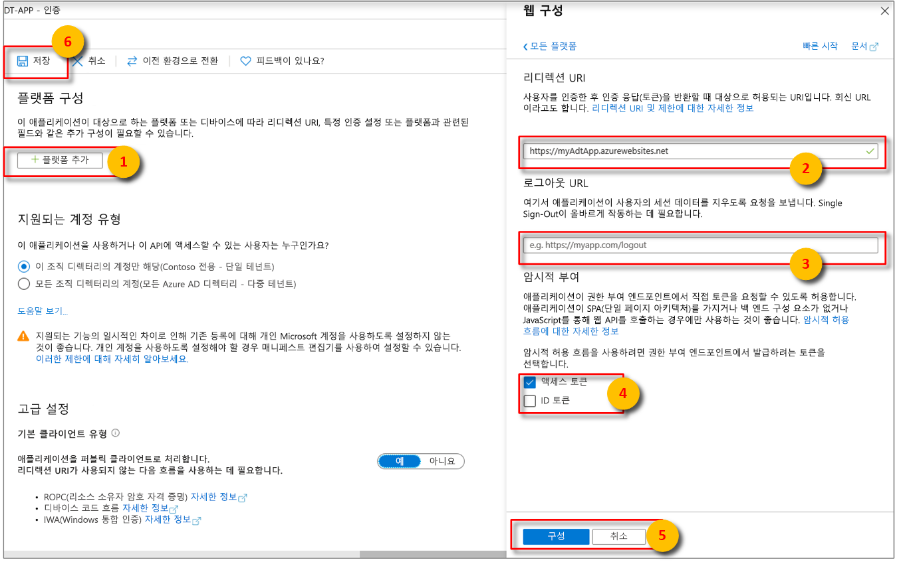

>[!NOTE]
>이 섹션에서는 [Azure AD 앱 등록](https://docs.microsoft.com/azure/active-directory/develop/quickstart-register-app)을 위한 지침을 제공합니다.

1. [Azure Portal](https://portal.azure.com)의 확장 가능한 왼쪽 메뉴에서 **Azure Active Directory**를 연 다음, **앱 등록** 창을 엽니다. 

    

1. **+새 등록** 단추를 선택합니다.

    

1. **이름** 상자에 이 앱 등록의 이름을 입력합니다. 

    1. **리디렉션 URI(선택 사항)** 섹션에서 텍스트 상자에 `https://microsoft.com`을 입력합니다.     

    1. Azure Active Directory 앱에서 지원되는 계정 및 테넌트를 확인합니다.

    1. **등록**을 선택합니다.

    

1. **인증** 블레이드에서는 중요한 인증 구성 설정을 지정합니다. 

    1. **리디렉션 URI**를 추가하고 **+ 플랫폼 추가**를 선택하여 **액세스 토큰**을 구성합니다.

    1. 앱이 **퍼블릭 클라이언트**임을 지정하려면 **예**를 선택합니다.

    1. Azure Active Directory 앱에서 지원되는 계정 및 테넌트를 확인합니다.

    

1. 적절한 플랫폼을 선택한 후 사용자 인터페이스 오른쪽의 측면 패널에서 **리디렉션 URI** 및 **액세스 토큰**을 구성합니다.

    1. **리디렉션 URI**는 인증 요청에 의해 제공된 주소와 일치해야 합니다.

        * 로컬 개발 환경에서 호스팅되는 앱의 경우 **공용 클라이언트(모바일 및 데스크톱)** 를 선택합니다. **퍼블릭 클라이언트**를 **예**로 설정해야 합니다.
        * Azure App Service에서 호스팅되는 단일 페이지 앱의 경우 **웹**을 선택합니다.

    1. **로그아웃 URL**이 적절한지 확인합니다.

    1. **액세스 토큰** 또는 **ID 토큰**을 확인하여 암시적 허용 흐름을 사용하도록 설정합니다.
                
    

    **구성**을 클릭한 다음, **저장**을 클릭합니다.

1.  등록된 앱의 **개요** 창을 열고 임시 파일에 다음 엔터티의 값을 복사합니다. 이러한 값을 사용하여 다음 섹션에서 샘플 애플리케이션을 구성할 수 있습니다.

    - **애플리케이션(클라이언트) ID**
    - **디렉터리(테넌트) ID**

    

1. 앱 등록을 위한 **API 사용 권한** 창을 엽니다. **+사용 권한 추가** 단추를 선택합니다. **API 사용 권한 요청** 창에서 **내 조직이 사용하는 API** 탭을 선택한 다음, 다음 중 하나를 검색합니다.
    
    1. `Azure Digital Twins`입니다. **Azure Digital Twins** API를 선택합니다.

        

    1. 또는 `Azure Smart Spaces Service`를 검색합니다. **Azure 스마트 공간 서비스** API를 선택합니다.

        

    > [!IMPORTANT]
    > 표시되는 Azure AD API 이름 및 ID는 테넌트에 따라 다릅니다.
    > * 테스트 테넌트 및 고객 계정은 `Azure Digital Twins`를 검색해야 합니다.
    > * 다른 Microsoft 계정은 `Azure Smart Spaces Service`를 검색해야 합니다.

1. API가 선택되면 동일한 **API 사용 권한 요청** 창에 **Azure Digital Twins**로 표시됩니다. **읽기** 드롭다운 옵션을 선택한 다음, **읽기/쓰기** 확인란을 선택합니다. **사용 권한 추가** 단추를 선택합니다.

    

1. 조직의 설정에 따라 이 API에 대한 관리자 액세스 권한을 부여하려면 추가 단계를 수행해야 할 수도 있습니다. 자세한 내용은 관리자에게 문의하세요. 관리자 액세스가 승인되면 **API 사용 권한** 창의 **관리자 동의 필요** 열에 사용자의 권한이 표시됩니다. 

    

    **Azure Digital Twins**가 표시되는지 확인합니다.
