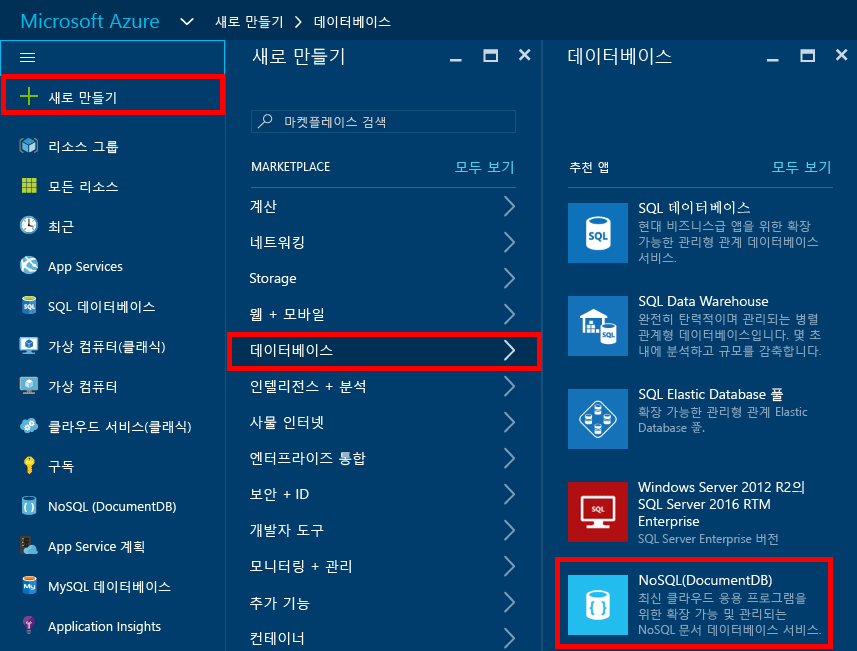
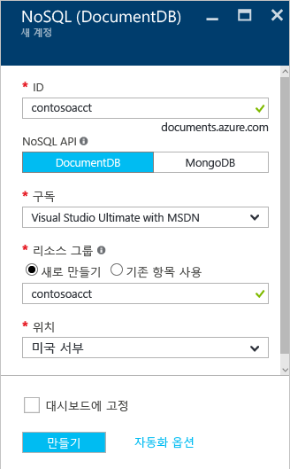
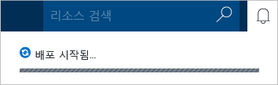
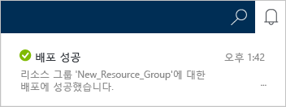

1.	[Azure 포털](https://portal.azure.com/)에 로그인합니다.
2.	표시줄에서 **새로 만들기**를 클릭하고 **데이터 + 저장소**를 클릭한 다음 **DocumentDB(NoSQL)**를 클릭합니다.

	

3. **새 계정** 블레이드에서 DocumentDB 계정에 대해 원하는 구성을 지정합니다.

	

	- **ID** 상자에 DocumentDB 계정을 식별하기 위한 이름을 입력합니다. **ID**의 유효성이 검사되면 **ID** 상자에 녹색 확인 표시가 나타납니다. **ID** 값은 URI 내의 호스트 이름이 됩니다. **ID**는 소문자, 숫자 및 '-' 문자만 포함할 수 있으며, 3자에서 50자 사이여야 합니다. 선택한 끝점 이름에 *documents.azure.com*이 추가되고, 그 결과가 DocumentDB 계정 끝점이 됩니다.

    - **NoSQL API** 상자에서 **DocumentDB**를 선택합니다.

	- **구독**에서 DocumentDB 계정에 사용할 Azure 구독을 선택합니다. 계정에 구독이 하나뿐인 경우 해당 계정이 기본적으로 선택됩니다.

	- **리소스 그룹**에서 DocumentDB 계정에 대한 리소스 그룹을 선택하거나 만듭니다. 기본적으로 새 리소스 그룹이 생성됩니다. 자세한 내용은 [Azure Portal을 사용하여 Azure 리소스 관리](../articles/azure-portal/resource-group-portal.md)를 참조하세요.

	- **위치**를 사용하여 DocumentDB 계정을 호스트하는 지리적 위치를 지정합니다.

4.	새 DocumentDB 계정 옵션을 구성했으면 **만들기**를 클릭합니다. 배포의 상태를 확인하려면 알림 허브를 선택합니다.

    

    

5.	DocumentDB 계정이 생성되면 기본 설정으로 사용할 수 있습니다. DocumentDB 계정의 기본 일관성은 **세션**으로 설정됩니다. 리소스 메뉴에서 **기본 일관성**을 클릭하여 기본 일관성을 조정할 수 있습니다. DocumentDB에서 제공되는 일관성 수준에 대한 자세한 내용은 [DocumentDB의 일관성 수준](../articles/documentdb/documentdb-consistency-levels.md)을 참조하세요.

    

    

[How to: Create a DocumentDB account]: #Howto
[Next steps]: #NextSteps
[documentdb-manage]: ../articles/documentdb/documentdb-manage.md

<!---HONumber=AcomDC_0914_2016-->