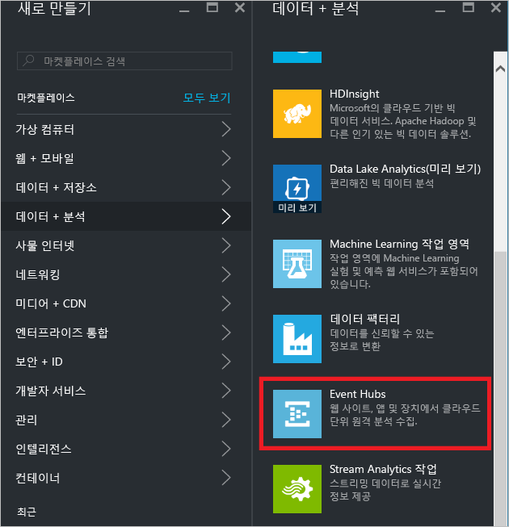
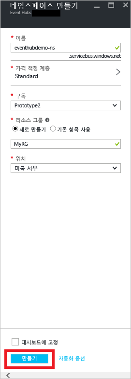
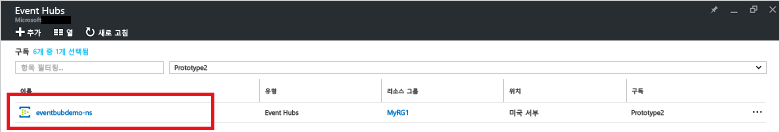
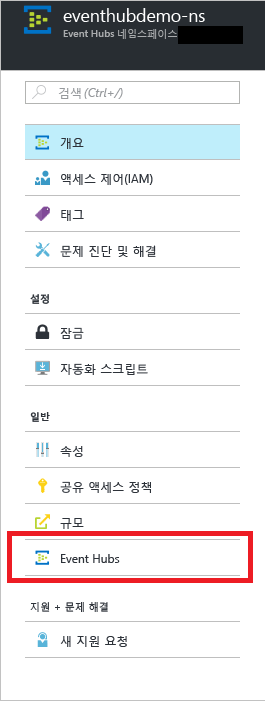
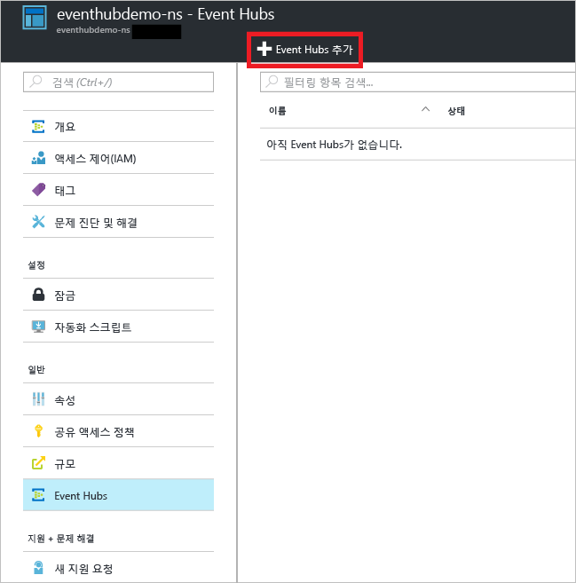
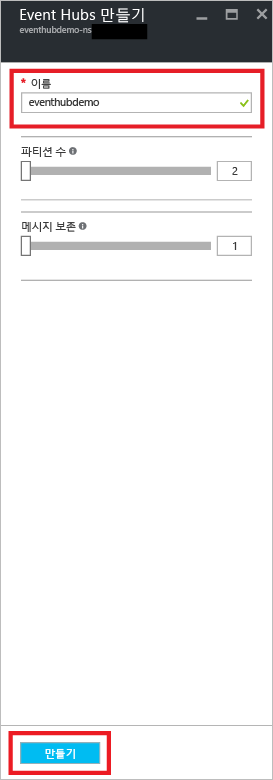
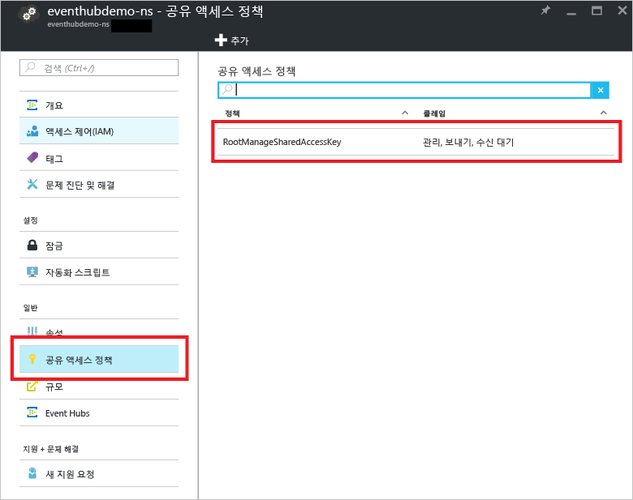
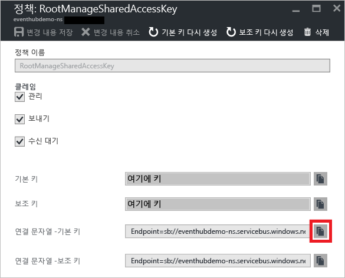

## 이벤트 허브 만들기

1. [Azure Portal][]에 로그온하고 화면 왼쪽 위에서 **새로 만들기**를 클릭합니다.

2. **데이터 + 분석**을 클릭한 다음 **Event Hubs**를 클릭합니다.

	

3. **네임스페이스 만들기** 블레이드에서 네임스페이스 이름을 입력합니다. 시스템에서 사용 가능한 이름인지 즉시 확인합니다.

	

4. 네임스페이스 이름을 사용할 수 있게 설정한 후 가격 책정 계층(기본 또는 표준)을 선택합니다. 또한 리소스를 만들 Azure 구독, 리소스 그룹 및 위치를 선택합니다.

2. **만들기**를 클릭하여 네임스페이스를 만듭니다.

6. Event Hubs 네임스페이스 목록에서 새로 만든 네임스페이스를 클릭합니다.

	

7. 네임스페이스 블레이드에서 **Event Hubs**를 클릭합니다.

	

8. 블레이드의 위쪽에서 **Event Hub 추가**를 클릭합니다.

	

3. Event Hub의 이름을 입력한 다음 **만들기**를 클릭합니다.

	

4. Event Hubs의 목록에서 새로 만든 Event Hub 이름을 클릭합니다.

	

5. 네임스페이스 블레이드(특정 Event Hub 블레이드가 아님)로 돌아와서 **공유 액세스 정책**을 클릭한 다음 **RootManageSharedAccessKey**를 클릭합니다.

	

5. 복사 단추를 클릭하여 클립보드에 대한 **RootManageSharedAccessKey** 연결 문자열을 복사합니다. 이 자습서 뒷부분에서 사용할 연결 문자열을 저장합니다.

	

이제 이벤트 허브가 만들어졌고 이벤트를 보내고 받기 위한 연결 문자열이 있습니다.

[Azure portal]: https://portal.azure.com/

<!---HONumber=AcomDC_0921_2016-->