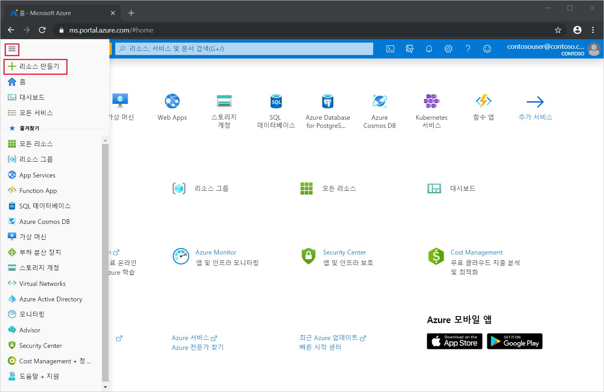
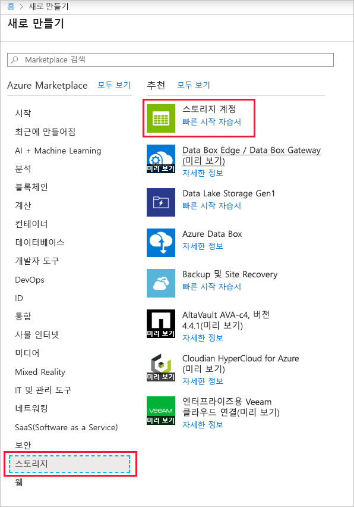
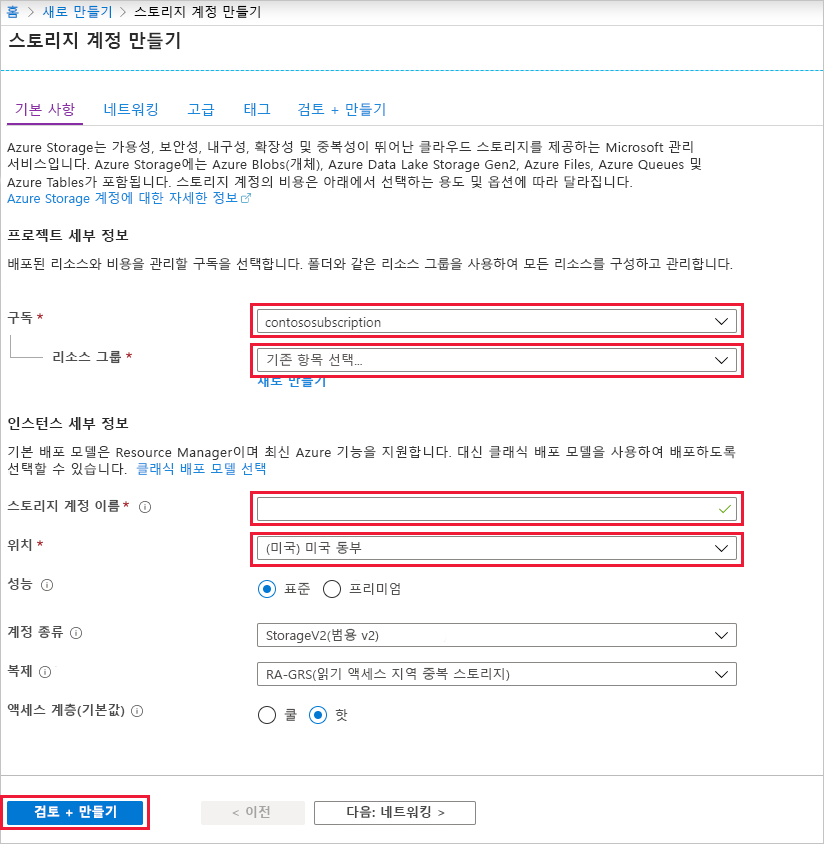
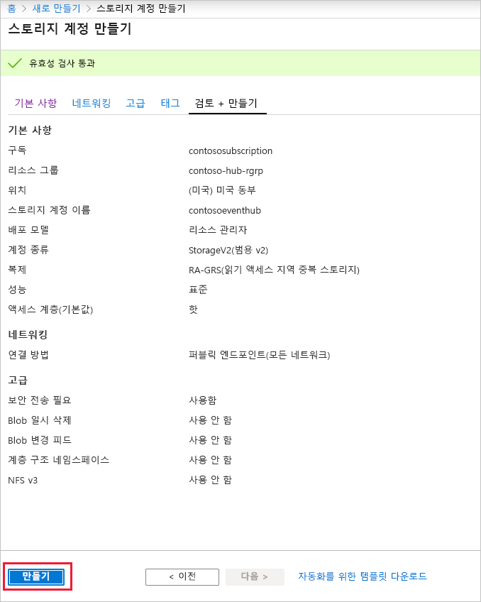
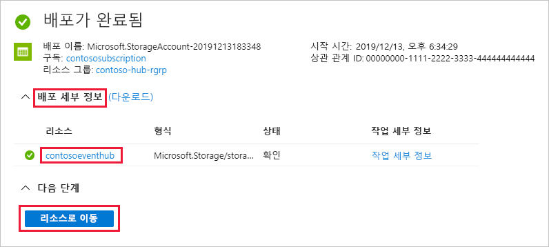
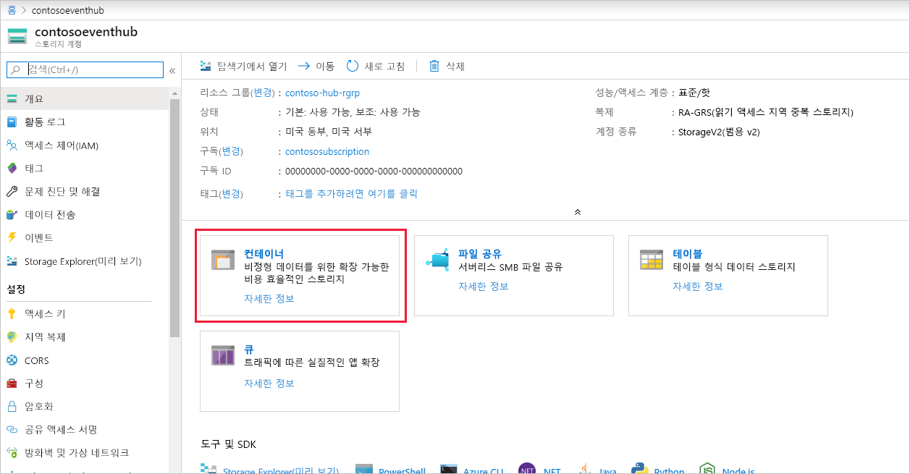

### 이벤트 처리기 호스트에 대한 스토리지 계정 만들기
이벤트 처리기 호스트는 영구적 검사점을 관리하여 Event Hubs의 이벤트 수신을 간소화하고 병렬 수신을 수행하는 지능형 에이전트입니다. 검사점 지정을 위해 이벤트 처리기 호스트에는 스토리지 계정이 필요합니다. 다음 예제에서는 스토리지 계정을 만들고 액세스를 위해 키를 가져오는 방법을 보여 줍니다.

1. Azure Portal 메뉴에서 **리소스 만들기**를 선택합니다.

    

2. **스토리지** > **스토리지 계정**을 선택합니다.
   
    

3. **스토리지 계정 만들기** 페이지에서 다음 단계를 수행합니다. 

   1. **스토리지 계정 이름**을 입력합니다.
   2. 이벤트 허브를 포함하는 Azure **구독**을 선택합니다.
   3. 이벤트 허브가 있는 **리소스 그룹**을 선택하거나 만듭니다.
   4. 리소스를 만들 **위치**를 선택합니다. 
   5. **검토 + 만들기**를 선택합니다.
   
        

4. **검토 + 만들기** 페이지에서 값을 검토하고 **만들기**를 선택합니다. 

    
5. 알림에서 **배포 성공** 메시지가 표시되면 **리소스로 이동**을 선택하여 스토리지 계정 페이지를 엽니다. 또는 **배포 세부 정보**를 확장한 다음, 리소스 목록에서 새 리소스를 선택할 수 있습니다.  

     
6. **컨테이너**를 선택합니다.

    
7. 위쪽에서 **+ 컨테이너**를 선택하고, 컨테이너에 대한 **이름**을 입력하고, **확인**을 선택합니다. 

    
8. **스토리지 계정** 페이지 메뉴에서 **액세스 키**를 선택하고, **key1** 값을 복사합니다.

    다음 값을 메모장 또는 다른 임시 위치에 저장합니다.
    - 스토리지 계정 이름
    - 스토리지 계정에 대한 액세스 키
    - 컨테이너 이름
