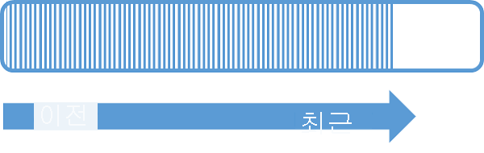

Event Hubs는 각 소비자만이 특정 하위 집합, 파티션 또는 메시지 스트림을 읽는 파티션된 소비자 패턴을 통해 메시지 스트리밍을 제공합니다. 이 패턴은 이벤트 처리를 위한 가로 눈금을 사용하며 큐 및 항목에 사용할 수 없는 기타 스트림 중심 기능을 제공합니다.

파티션은 Event Hub에서 보유하는 순서가 지정된 이벤트 시퀀스입니다. 최신 이벤트가 도착하면 이 시퀀스의 끝에 추가됩니다. 파티션을 "커밋 로그"로 생각할 수 있습니다.

Event Hubs는 Event Hub의 모든 파티션에 적용되도록 구성된 보존 시간에 대한 데이터를 유지합니다. 시간 단위로 이벤트가 만료됩니다. 명시적으로 삭제할 수 없습니다. 파티션은 독립적이며 자체 데이터 시퀀스를 포함하기 때문에 종종 다른 속도로 증가합니다.

파티션 수는 만들 때 지정되며 2와 32 사이여야 합니다. 파티션 수는 변경할 수 없으므로 파티션 수를 설정할 때 장기적인 규모를 고려해야 합니다. 파티션은 애플리케이션을 사용하는 데 필요한 다운스트림 병렬 처리와 관련된 데이터 구성 메커니즘입니다. Event Hub의 파티션 수는 예상되는 동시 판독기의 수와 직접적으로 관련이 있습니다. Event Hubs 팀에 문의하여 32개를 초과하는 파티션 수를 늘릴 수 있습니다.

만들 때 가장 높은 값(32)으로 설정할 수 있습니다. 두 개 이상의 파티션이 있는 경우 전송자가 32개 중에서 단일 파티션으로만 전송하도록 구성하여 나머지 31개 파티션이 중복되도록 하지 않는 한, 두 개 이상의 파티션이 순서를 유지하지 않으면서 여러 파티션으로 이벤트가 전송됩니다. 전자의 경우에는 모든 32개 파티션에서 이벤트를 읽어야 합니다. 후자의 경우에는 이벤트 프로세서 호스트에서 수행해야 하는 추가 구성에 대한 명확한 추가 비용이 발생하지 않습니다.

파티션은 식별 가능하고 직접 보낼 수 있지만 파티션으로 직접 보내는 방법은 권장하지 않습니다. 대신 [이벤트 게시자](../articles/event-hubs/event-hubs-features.md#event-publishers) 섹션에서 소개하는 더 높은 수준의 구문을 사용할 수 있습니다. 

파티션은 이벤트 본문, 사용자 정의 속성 모음 및 파티션의 오프셋과 스트림 시퀀스의 번호와 같은 메타데이터를 포함하는 이벤트 데이터 시퀀스로 채워집니다.

최적의 규모를 달성하려면 처리량 단위와 파티션 간에 1:1 균형을 유지하는 것이 좋습니다. 단일 파티션에는 최대 하나의 처리량 단위에 대한 수신 및 송신이 보장됩니다. 파티션에서 처리량을 높일 수는 있지만 성능이 보장되지는 않습니다. 따라서 이벤트 허브의 파티션 수를 처리량 단위 수보다 크거나 동일하게 설정할 것을 강력히 권장합니다.

필요한 총 예상 처리량을 고려하면 필요한 처리량 단위 수와 최소 파티션 수를 알 수 있습니다. 그렇다면 필요한 파티션 수는 얼마인가요? 구현하려는 다운스트림 병렬 처리와 향후 처리량 요구 사항에 따라 파티션 수를 선택하세요. Event Hub 내에 있는 파티션 수에는 요금이 부과되지 않습니다.

파티션 및 가용성과 안정성 간의 균형에 대한 자세한 내용은 [Event Hubs 프로그래밍 가이드](../articles/event-hubs/event-hubs-programming-guide.md#partition-key) 및 [Event Hubs의 가용성 및 일관성](../articles/event-hubs/event-hubs-availability-and-consistency.md) 문서를 참조하세요.
