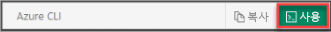

이 문서에서는 PowerShell cmdlet을 사용합니다. Cmdlet을 실행 하려면 Azure Cloud Shell을 Azure에서 호스팅되며 브라우저를 통해 사용 되는 대화형 셸 환경을 사용할 수 있습니다. 미리 설치 된 Azure PowerShell cmdlet을 사용 하 여 azure Cloud Shell 제공 됩니다.

Azure Cloud Shell에서이 문서에 포함 된 모든 코드를 실행 하려면 Cloud Shell 세션을 열고, 사용 합니다 **복사본** 코드를 복사 하 여 사용 하 여 Cloud Shell 세션에 붙여 넣습니다 코드 블록에서 단추 __Ctrl + Shift + V__ 에서 Windows 및 Linux에서 또는 __Cmd + Shift + V__ macOS에서. 붙여넣은 텍스트 자동으로 실행 되지 않습니다, 따라서 키를 눌러 **Enter** 코드를 실행 합니다.

사용 하 여 Azure Cloud Shell을 시작할 수 있습니다.

|  |   |
|-----------------------------------------------|---|
| 코드 블록의 오른쪽 위 모서리에서 **사용**을 선택합니다. 이렇게 __하지__ 자동으로 Cloud Shell에 텍스트를 복사 합니다. |  |
| 오픈 [shell.azure.com](https://shell.azure.com) 브라우저에서 합니다. |  |
| [Azure Portal](https://portal.azure.com) 오른쪽 위에 있는 메뉴에서 **Cloud Shell** 단추를 선택합니다. |  |

Azure Cloud Shell을 사용 하지 않으려는 경우 Azure PowerShell 로컬로 대신 설치 합니다. 최신 기능을 활용 하려면 Azure PowerShell Az 모듈의 최신 버전을 설치 해야 합니다. 자세한 내용은 [Azure PowerShell 설치](/powershell/azure/overview)를 참조하세요.
