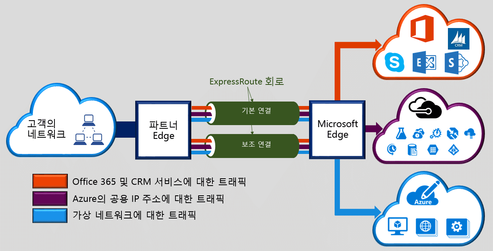

Microsoft Azure Express 경로를 사용하면 연결 공급자에서 쉽게 처리된 전용 개인 연결을 통해 온-프레미스 네트워크를 Microsoft 클라우드로 확장할 수 있습니다. Express 경로를 사용하면 Microsoft Azure, Office 365, CRM Online과 같은 Microsoft 클라우드 서비스에 대한 연결을 설정하거나, 공동 배치 시설에서 연결 공급자를 통해 임의의(IP VPN) 네트워크, 지점간 이더넷 네트워크 또는 가상 간 연결에서 연결할 수 있습니다. Express 경로 연결은 공용 인터넷을 통해 이동하지 않습니다. 이 기능을 사용하면 Express 경로 연결은 인터넷을 통한 일반 연결보다 안정적이고 속도가 빠르며 대기 시간이 짧고 보안성이 높습니다.

<!---HONumber=AcomDC_0727_2016-->