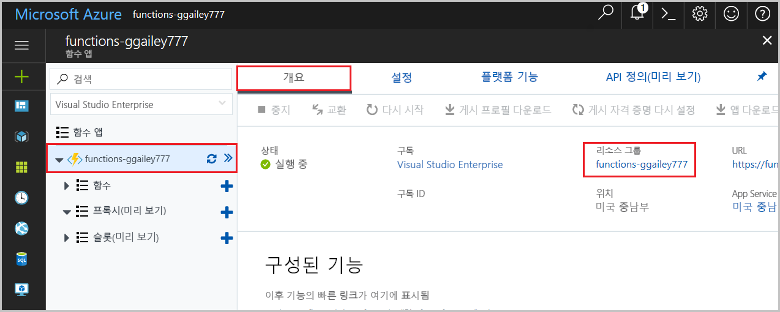

1. Visual Studio Code에서 F1 키를 눌러 명령 팔레트를 엽니다. 명령 팔레트에서 `Azure Functions: Open in portal`을 검색하여 선택합니다.

1. 함수 앱을 선택한 다음, Enter 키를 누릅니다. 함수 앱 페이지는 [Azure Portal](https://portal.azure.com)에서 열립니다.

1. **개요** 탭에서 **리소스 그룹** 아래에 있는 명명된 링크를 선택합니다.

    

1. **리소스 그룹** 페이지에서 포함된 리소스 목록을 검토하고 삭제하려는 항목인지 확인합니다.
 
1. **리소스 그룹 삭제**를 선택하고 지시를 따릅니다.

   삭제는 몇 분 정도 소요됩니다. 완료되면 알림이 잠시 표시됩니다. 페이지 위쪽의 종 모양 아이콘을 선택해도 알림을 확인할 수 있습니다.