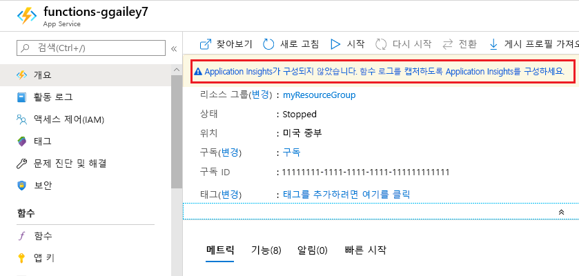
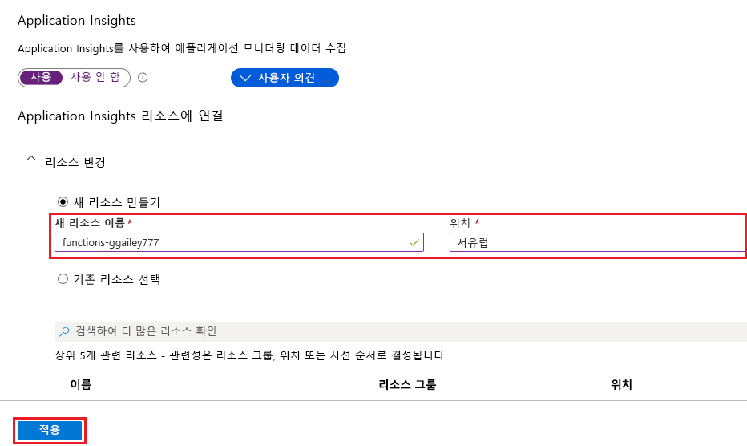

Functions를 사용하면 간단하게 [Azure Portal]에서 함수 앱에 Application Insights 통합을 추가할 수 있습니다.

1. [포털][Azure Portal]에서 **모든 서비스 > 함수 앱**을 선택하고 해당 함수 앱을 선택한 다음, 창 맨 위에 있는 **Application Insights**를 선택합니다.

    

1. 다음과 같이 이미지 아래의 표에 지정된 설정을 사용하여 Application Insights 리소스를 만듭니다.

   

    | 설정      | 제안 값  | 설명                                        |
    | ------------ |  ------- | -------------------------------------------------- |
    | **Name** | 고유한 앱 이름 | 함수 앱과 동일한 이름을 사용하는 것이 가장 간단하며, 구독 내에서 고유해야 합니다. | 
    | **위치**: | 서유럽 | 가능하다면 함수 앱과 동일한 [Azure 지역](https://azure.microsoft.com/regions/) 또는 그 근처 지역을 사용합니다. |

1. **확인**을 선택합니다. 함수 앱과 동일한 리소스 그룹 및 구독에 Application Insights 리소스가 만들어집니다. 만들기가 완료되면 Application Insights 창을 닫습니다.

1. 함수 앱으로 돌아가서 **애플리케이션 설정**을 선택하고, **애플리케이션 설정**이 나올 때까지 아래로 스크롤합니다. `APPINSIGHTS_INSTRUMENTATIONKEY`라는 설정이 보이면 Azure에서 실행 중인 함수 앱에 Application Insights 통합이 사용된다는 의미입니다.

[Azure Portal]: https://portal.azure.com
