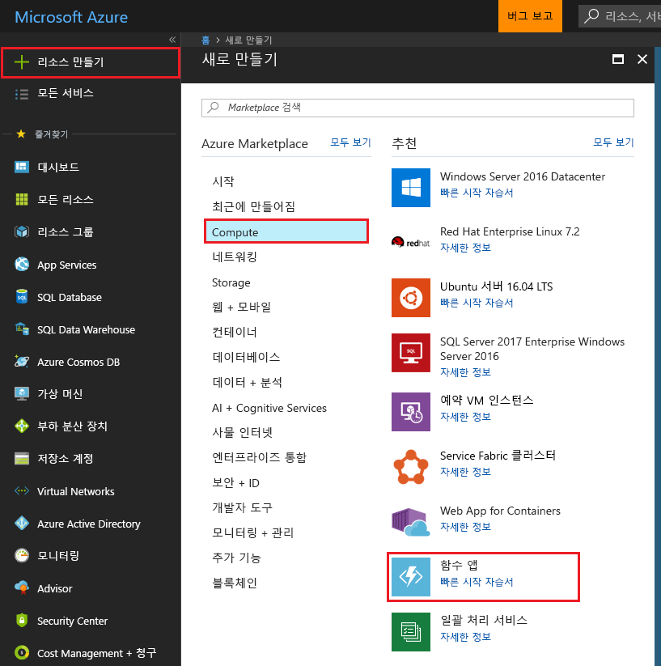
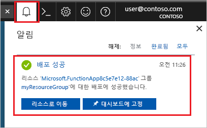

1. Azure Portal의 왼쪽 위 모서리에 있는 **리소스 만들기** 단추를 선택한 다음, **계산** > **Function App**을 차례로 선택합니다.

    

2. 이미지 아래 표에 지정된 것처럼 함수 앱 설정을 사용합니다.

    

    | 설정      | 제안 값  | 설명                                        |
    | ------------ |  ------- | -------------------------------------------------- |
    | **앱 이름** | 전역적으로 고유한 이름 | 새 함수 앱을 식별하는 이름입니다. 유효한 문자는 `a-z`, `0-9` 및 `-`입니다.  | 
    | **구독** | 사용자의 구독 | 이 새 함수 앱이 만들어질 구독입니다. | 
    | **[리소스 그룹](../articles/azure-resource-manager/resource-group-overview.md)** |  myResourceGroup | 함수 앱을 만들 새 리소스 그룹의 이름입니다. |
    | **OS** |  Windows | Linux의 서버리스 호스팅은 현재 미리보기로 제공됩니다. 자세한 내용은 [이 고려 사항 문서](https://aka.ms/funclinux)를 참조하세요.|
    | **[호스팅 계획](../articles/azure-functions/functions-scale.md)** | 소비 계획 | 함수 앱에 리소스가 할당되는 방법을 정의하는 호스팅 계획입니다. 기본 **소비 계획**에서 함수의 필요에 따라 리소스가 동적으로 추가됩니다. [서버 없는](https://azure.microsoft.com/overview/serverless-computing/) 호스팅에서는 함수가 실행되는 시간 만큼만 요금을 지불하면 됩니다. App Service 계획에서 실행하는 경우 [함수 앱의 크기 조정](../articles/azure-functions/functions-scale.md)을 관리해야 합니다.  |
    | **위치**: | 서유럽 | 사용자 근처 또는 함수가 액세스할 기타 서비스에 가까운 [지역](https://azure.microsoft.com/regions/)을 선택합니다. |
    | **런타임 스택** | 기본 설정 언어 | 즐겨찾는 함수 프로그래밍 언어를 지원하는 런타임을 선택합니다. C# 및 F# 함수의 경우 **.NET**을 선택합니다. |
    | **[Storage](../articles/storage/common/storage-quickstart-create-account.md)** |  전역적으로 고유한 이름 |  함수 앱에서 사용하는 저장소 계정을 만듭니다. Storage 계정 이름은 3자에서 24자 사이여야 하고 숫자 및 소문자만 포함할 수 있습니다. 기존 계정을 사용할 수도 있습니다. 여기서는 [저장소 계정 요구 사항](../articles/azure-functions/functions-scale.md#storage-account-requirements)을 충족해야 합니다. |
    | **[Application Insights](../articles/azure-functions/functions-monitoring.md)** | 기본값 | 가장 가까운 지원 영역에 동일한 *앱 이름*의 Application Insight 리소스를 만듭니다. 이 설정을 확장하면 **새 리소스 이름**을 변경하거나 데이터를 저장하려는 [Azure 지리적 위치](https://azure.microsoft.com/global-infrastructure/geographies/)에서 다른 **위치**를 선택합니다. |

3. **만들기**를 선택하여 함수 앱을 프로비전하고 배포합니다.

4. 포털의 오른쪽 위 모서리에 있는 [알림] 아이콘을 선택하고 **배포 성공** 메시지가 표시될 때까지 기다립니다.

    

5. **리소스로 이동**을 선택하여 함수 앱을 봅니다.

> [!TIP]
> 포털에서 함수 앱을 찾는 데 문제가 있는 경우 [Azure Portal에서 즐겨찾기에 Function App을 추가](../articles/azure-functions/functions-how-to-use-azure-function-app-settings.md#favorite)합니다.
