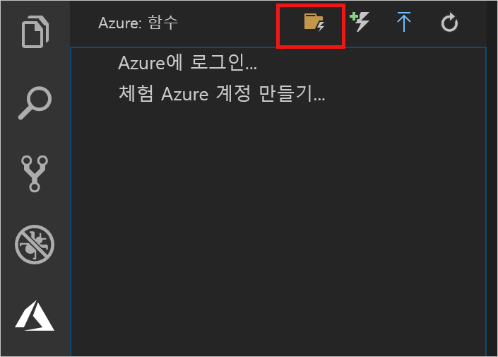
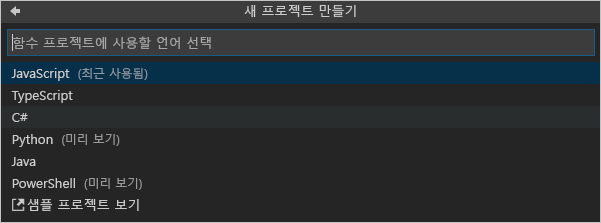

## Azure Functions 프로젝트 만들기

Visual Studio Code의 Azure Functions 프로젝트 템플릿은 Azure에서 함수 앱에 게시할 수 있는 프로젝트를 만듭니다. 함수 앱을 통해 함수를 논리적 단위로 그룹화하여 관리, 배포 및 리소스를 공유할 수 있습니다.

1. Visual Studio Code에서 **Azure: Functions** 영역을 표시하도록 Azure 로고를 선택한 다음, 새 프로젝트 만들기 아이콘을 선택합니다.

    

1. 프로젝트 작업 영역에 대한 위치를 선택하고 **선택**을 선택합니다.

    > [!NOTE]
    > 이 문서는 작업 영역 외부에서 완료하도록 설계되었습니다. 이 경우 작업 영역에 포함된 프로젝트 폴더를 선택하지 마십시오.

1. 함수 앱 프로젝트에 대한 언어를 선택합니다. 이 문서에서는 JavaScript가 사용됩니다.
    

1. 메시지가 표시되면 **작업 영역에 추가**를 선택합니다.

Visual Studio Code는 새 작업 영역에서 함수 앱 프로젝트를 만듭니다. 이 프로젝트에는 [host.json](../articles/azure-functions/functions-host-json.md) 및 [local.settings.json](../articles/azure-functions/functions-run-local.md#local-settings-file) 구성 파일과 언어별 프로젝트 파일이 포함됩니다. 또한 프로젝트 폴더에 새 Git 리포지토리를 가져올 수 있습니다.