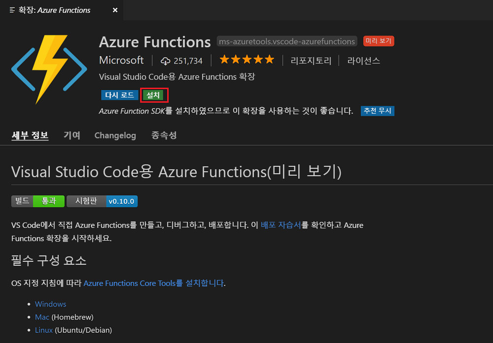
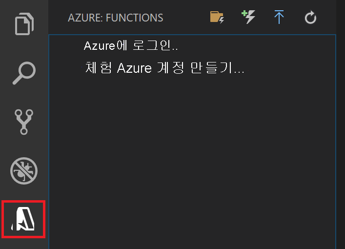

## Azure Function 확장 설치

Azure Functions 확장은 함수를 Azure에 만들고, 테스트 및 배포하는 데 사용됩니다.

1. Visual Studio Code에서 **확장**을 열고 `azure functions`를 검색하거나 [Visual Studio Code에서 이 링크를 엽니다](vscode:extension/ms-azuretools.vscode-azurefunctions).

1. **설치**를 선택하여 Visual Studio Code에 확장을 설치합니다.

    

1. Visual Studio Code를 다시 시작하고 작업 표시줄에서 Azure 아이콘을 선택합니다. 사이드바에 Azure Functions 영역이 표시됩니다.

    