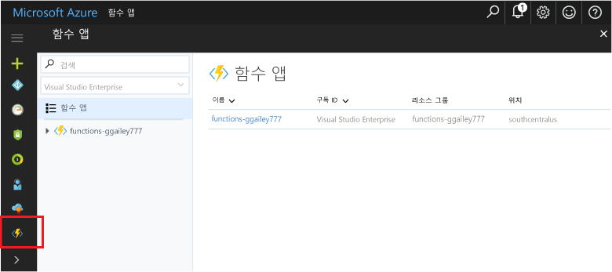

## 포털의 즐겨 찾는 함수 

아직 수행하지 않은 경우 Azure Portal에서 즐겨찾기에 함수 앱을 추가합니다. 이렇게 하면 함수 앱을 보다 쉽게 찾을 수 있습니다. 이미 이 작업을 수행한 경우 다음 섹션으로 건너뜁니다. 

1. [Azure Portal](https://portal.azure.com/)에 로그인합니다.

2. 맨 아래 왼쪽에서 화살표를 클릭하여 모든 서비스를 확장하고 **필터** 필드에 `Functions`를 입력한 후 **Function Apps** 옆의 별 모양을 클릭합니다.  
 
    

    그러면 Functions 아이콘이 포털 왼쪽 메뉴에 추가됩니다.

3. 메뉴를 닫은 후 맨 아래로 스크롤하면 Functions 아이콘이 표시됩니다. 이 아이콘을 클릭하면 모든 함수 앱 목록이 표시됩니다. 이 앱에서 함수로 작업하려면 함수 앱을 클릭합니다. 
 
    
 
     