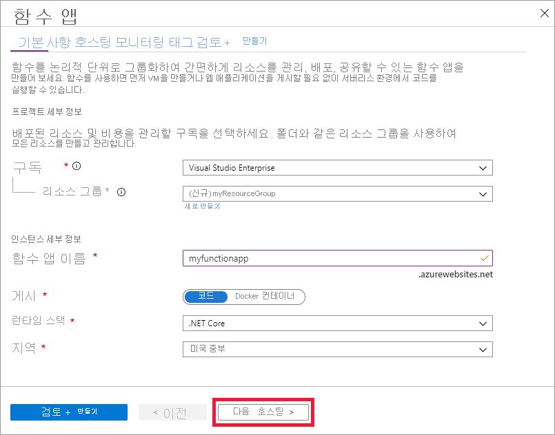
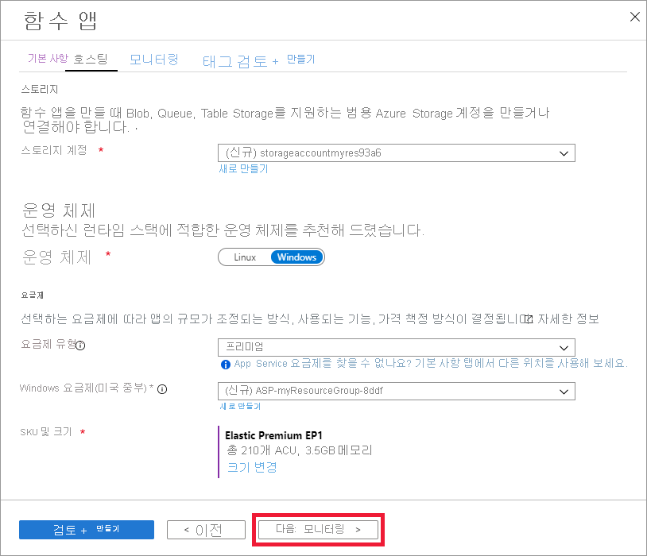

1. 에서 Azure 포털 을 엽니다.[https://portal.azure.com](https://portal.azure.com)

1. **리소스 만들기** 단추 선택

    

1. 계산**함수 앱을** **선택합니다.** > 

    

1. 이미지 아래 표에 지정된 것처럼 함수 앱 설정을 사용합니다.

    

    | 설정      | 제안 값  | 설명 |
    | ------------ | ---------------- | ----------- |
    | **구독** | 사용자의 구독 | 이 새 함수 앱이 만들어질 구독입니다. |
    | **[리소스 그룹](../articles/azure-resource-manager/management/overview.md)** |  *myResourceGroup* | 함수 앱을 만들 새 리소스 그룹의 이름입니다. |
    | **함수 앱 이름** | 전역적으로 고유한 이름 | 새 함수 앱을 식별하는 이름입니다. 유효한 문자는 `a-z`(대/소문자 구분 안 함), `0-9`및 `-`입니다.  |
    |**게시**| 코드 | 코드 파일 또는 Docker 컨테이너를 게시하는 옵션입니다. |
    | **런타임 스택** | 기본 설정 언어 | 즐겨찾는 함수 프로그래밍 언어를 지원하는 런타임을 선택합니다. C# 및 F# 함수에 대해 **.NET을** 선택합니다. |
    |**지역**| 기본 지역 | 사용자 근처 또는 함수가 액세스할 기타 서비스에 가까운 [지역](https://azure.microsoft.com/regions/)을 선택합니다. |

    다음 : 호스팅 >버튼을 **선택합니다.**

1. 다음 호스팅 설정을 입력합니다.

    

    | 설정      | 제안 값  | 설명 |
    | ------------ | ---------------- | ----------- |
    | **[Storage 계정](../articles/storage/common/storage-account-create.md)** |  전역적으로 고유한 이름 |  함수 앱에서 사용하는 스토리지 계정을 만듭니다. Storage 계정 이름은 3자에서 24자 사이여야 하고 숫자 및 소문자만 포함할 수 있습니다. 기존 계정을 사용할 수도 있습니다. 여기서는 [스토리지 계정 요구 사항](../articles/azure-functions/functions-scale.md#storage-account-requirements)을 충족해야 합니다. |
    |**운영 체제**| 기본 설정 운영 체제 | 운영 체제는 런타임 스택 선택에 따라 미리 선택되지만 필요한 경우 설정을 변경할 수 있습니다. |
    | **[계획](../articles/azure-functions/functions-scale.md)** | Premium | 계획 유형의 경우 **프리미엄(미리 보기)을** 선택하고 *Windows 요금제* 및 *Sku 및 크기* 선택 항목에 대한 기본값을 선택합니다. |

    다음 : 모니터링 >버튼을 **선택합니다.**

1. 다음 모니터링 설정을 입력합니다.

    

    | 설정      | 제안 값  | 설명 |
    | ------------ | ---------------- | ----------- |
    | **[애플리케이션 정보](../articles/azure-functions/functions-monitoring.md)** | 기본값 | 가장 가까운 지원 영역에 동일한 *앱 이름*의 Application Insight 리소스를 만듭니다. 이 설정을 확장하면 **새 리소스 이름**을 변경하거나 데이터를 저장하려는 [Azure 지리적 위치](https://azure.microsoft.com/global-infrastructure/geographies/)에서 다른 **위치**를 선택합니다. |

    **검토 + 만들기**를 선택하여 앱 구성 선택을 검토합니다.

1. **만들기**를 선택하여 함수 앱을 프로비전하고 배포합니다.