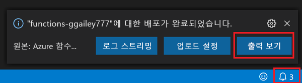
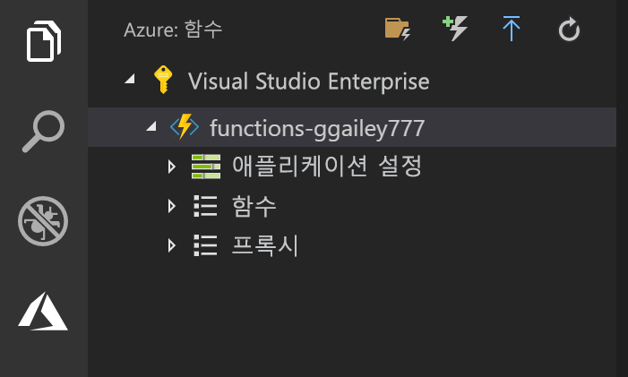

## Azure에 프로젝트 게시

Visual Studio Code를 사용하면 Azure에 직접 함수 프로젝트를 게시할 수 있습니다. 프로세스를 통해 함수 앱 및 관련된 리소스를 Azure 구독에서 만듭니다. 함수 앱은 함수를 위한 실행 컨텍스트를 제공합니다. 프로젝트는 패키지되어 Azure 구독에서 새 함수 앱에 배포됩니다. 

이 문서에서는 새 함수 앱을 만든다고 가정합니다. 기존 함수 앱에 게시하면 Azure에서 해당 앱의 콘텐츠를 덮어씁니다.

1. **Azure: Functions** 영역에서 함수 앱에 배포 아이콘을 선택합니다.

    

1. 현재 작업 영역인 프로젝트 폴더를 선택합니다.

1. 둘 이상의 구독이 있는 경우 함수 앱을 호스트하려는 것을 선택한 다음, **+ 새 함수 앱 만들기**를 선택합니다.

1. 함수 앱을 식별하는 전역적으로 고유한 이름을 입력하고 Enter 키를 누릅니다. 함수 앱 이름에 대한 유효한 문자는 `a-z`, `0-9` 및 `-`입니다.

1. **+ 새 리소스 그룹 만들기**를 선택하고 `myResourceGroup`과 같은 리소스 그룹 이름을 입력한 후 Enter 키를 누릅니다. 기존 리소스 그룹을 사용할 수도 있습니다.

1. **+ 새 스토리지 계정 만들기**를 선택하고, 함수 앱에서 사용되는 새 스토리지 계정에 대해 글로벌로 고유한 이름을 입력하고, Enter 키를 누릅니다. Storage 계정 이름은 3자에서 24자 사이여야 하고 숫자 및 소문자만 포함할 수 있습니다. 기존 계정을 사용할 수도 있습니다.

1. 사용자 근처 또는 함수가 액세스할 기타 서비스에 가까운 [지역](https://azure.microsoft.com/regions/)의 위치를 선택합니다.

    사용자의 위치를 선택한 후 함수 앱 만들기를 시작합니다. 함수 앱을 만들고 배포 패키지가 적용되면 알림이 표시됩니다.

1. 알림에서 **출력 보기**를 선택하여 사용자가 만든 Azure 리소스를 포함한 만들기 및 배포 결과를 표시합니다.

    

1. Azure에서 새 함수 앱의 URL을 기록해 둡니다. 이는 프로젝트가 Azure에 게시된 후 함수를 테스트하는 데 사용합니다.

    

1. **Azure: Functions** 영역으로 돌아가면 사용자 구독 아래에 새 함수 앱이 표시됩니다. 이 노드를 확장하면 애플리케이션 설정 및 함수 프록시와 함께 함수 앱의 함수가 표시됩니다.

    

    함수 앱 노드에서 Ctrl 키와 함께 마우스 오른쪽 단추를 클릭하여 Azure에서 함수 앱에 대한 다양한 관리 및 구성 작업을 수행하도록 선택합니다. 또한 Azure Portal에서 함수 앱을 보도록 선택할 수 있습니다.
