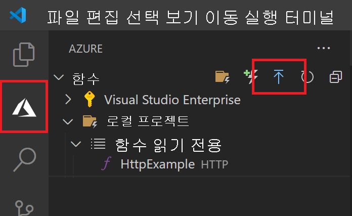
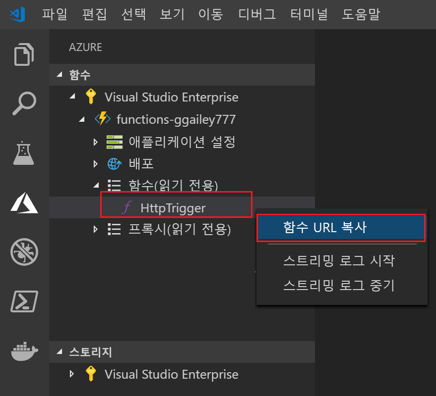

## Azure에 프로젝트 게시

Visual Studio Code를 사용하면 Azure에 직접 함수 프로젝트를 게시할 수 있습니다. 프로세스를 통해 함수 앱 및 관련된 리소스를 Azure 구독에서 만듭니다. 함수 앱은 함수를 위한 실행 컨텍스트를 제공합니다. 프로젝트는 패키지되어 Azure 구독에서 새 함수 앱에 배포됩니다.

이 문서에서는 새 함수 앱을 만든다고 가정합니다. 

> [!IMPORTANT]
> 기존 함수 앱에 게시하면 Azure에서 해당 앱의 콘텐츠를 덮어씁니다.

1. **Azure: Functions** 영역에서 함수 앱에 배포 아이콘을 선택합니다.

    

1. 로그인하지 않으면 **Azure에 로그인**하라는 메시지가 표시됩니다. 또한 **무료 Azure 계정을 만들** 수 있습니다. 브라우저에서 성공적으로 로그인한 후 Visual Studio Code로 다시 이동합니다. 

1. 여러 구독이 있다면 함수 앱에 대해 **구독을 선택**한 다음, **+ Azure에서 새 함수 앱 만들기**를 선택합니다.

1. 함수 앱을 식별하는 전역적으로 고유한 이름을 입력하고 Enter 키를 누릅니다. 함수 앱 이름에 대한 유효한 문자는 `a-z`, `0-9` 및 `-`입니다.

1. **+ 새 리소스 그룹 만들기**를 선택하고 `myResourceGroup`과 같은 리소스 그룹 이름을 입력한 후 Enter 키를 누릅니다. 기존 리소스 그룹을 사용할 수도 있습니다.

1. **+ 새 스토리지 계정 만들기**를 선택하고, 함수 앱에서 사용되는 새 스토리지 계정에 대해 글로벌로 고유한 이름을 입력하고, Enter 키를 누릅니다. Storage 계정 이름은 3자에서 24자 사이여야 하고 숫자 및 소문자만 포함할 수 있습니다. 기존 계정을 사용할 수도 있습니다.

1. 사용자 근처 또는 함수가 액세스할 기타 서비스에 가까운 [지역](https://azure.microsoft.com/regions/)의 위치를 선택합니다.

    Enter 키를 누르면 다음 Azure 리소스가 구독에서 생성됩니다.

    * **[리소스 그룹](../articles/azure-resource-manager/resource-group-overview.md)** : 만든 Azure 리소스를 모두 포함합니다. 이름은 함수 앱 이름을 기반으로 합니다.
    * **[스토리지 계정](../articles/storage/common/storage-quickstart-create-account.md)** : 표준 스토리지 계정은 함수 앱 이름을 기반으로 하는 고유한 이름으로 만들어집니다.
    * **[호스팅 계획](../articles/azure-functions/functions-scale.md)** : 소비 계획은 서버리스 함수 앱을 호스트할 미국 서부 지역에 생성됩니다.
    * **함수 앱**: 프로젝트가 이 새 함수 앱에 배포되고 실행됩니다.

    함수 앱을 만들고 배포 패키지가 적용되면 알림이 표시됩니다. 이 알림에서 **출력 보기**를 선택하여 사용자가 만든 Azure 리소스를 포함한 만들기 및 배포 결과를 표시합니다.

1. **Azure: Functions** 영역에서 구독에 있는 새 함수 앱을 확장합니다. **함수**를 확장하고, **HttpTrigger**를 마우스 오른쪽 단추로 클릭한 다음, **함수 URL 복사**를 선택합니다.

    
