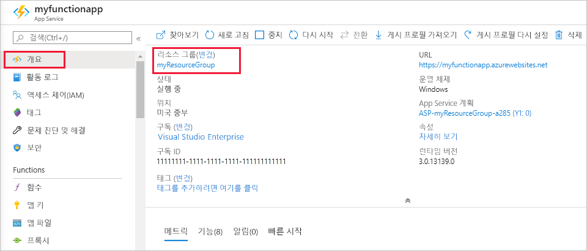

이 컬렉션의 다른 빠른 시작은 이 빠른 시작을 기반으로 합니다. 이후의 빠른 시작, 자습서 또는 기타 이 빠른 시작에서 만든 서비스를 사용하여 작업하려는 경우 이 빠른 시작에서 만든 리소스를 정리하지 않습니다.

Azure에서 *리소스*란 앱, 함수, 저장소 계정 등을 의미합니다. 리소스는 *리소스 그룹*으로 그룹화되며 그룹을 삭제하면 그룹의 모든 항목을 삭제할 수 있습니다. 

이러한 빠른 시작을 완료하기 위해 리소스를 만들었습니다. [계정 상태](https://azure.microsoft.com/account/) 및 [서비스 가격 책정](https://azure.microsoft.com/pricing/)에 따라 리소스에 대해 요금이 청구될 수 있습니다. 리소스가 더 이상 필요하지 않게 되면 다음과 같이 삭제합니다.

1. Azure Portal에서 **리소스 그룹** 페이지로 이동합니다. 

   함수 앱 페이지에서 해당 페이지로 이동하려면 **개요** 탭을 선택한 후 **리소스 그룹** 아래의 링크를 선택합니다.

   

   대시보드에서 해당 페이지로 이동하려면 **리소스 그룹**을 선택한 다음 이 빠른 시작에 사용한 리소스 그룹을 선택합니다.

2. **리소스 그룹** 페이지에서 포함된 리소스 목록을 검토하고 삭제하려는 항목인지 확인합니다.
 
3. **리소스 그룹 삭제**를 선택하고 지시를 따릅니다.

   삭제는 몇 분 정도 소요됩니다. 완료되면 알림이 잠시 표시됩니다. 페이지 위쪽의 종 모양 아이콘을 선택해도 알림을 확인할 수 있습니다.
