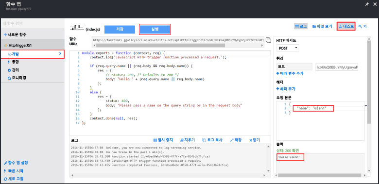

Azure Functions 빠른 시작에는 함수 코드가 포함되어 있어 새 함수를 즉시 테스트할 수 있습니다.

1. **개발** 탭에서 **코드** 창을 검토하고 이 Node.js 코드에는 메시지 본문 또는 쿼리 문자열에 전달된 *이름* 값과 함께 HTTP 요청이 필요함을 확인합니다. 함수가 실행되면 이 값은 응답 메시지에 반환됩니다.
   
2. **테스트**를 클릭하여 함수에 대해 기본 제공되는 HTTP 테스트 요청 창을 표시합니다.
 
    

3. **요청 본문** 텍스트 상자에서 *이름* 속성의 값을 자신의 이름으로 변경하고 **실행**을 클릭합니다. 실행이 테스트 HTTP 요청에 의해 트리거되고 정보가 로그에 기록되며 "hello..." 응답이 **출력**에 표시되는지 확인합니다. 

4. HTTP 테스트 도구 또는 다른 브라우저 창에서 동일한 함수의 실행을 트리거하려면 **개발** 탭에서 **함수 URL** 값을 복사하고 도구 또는 브라우저 주소 표시줄에 붙여 넣습니다. URL에 쿼리 문자열 값 `&name=yourname`을 추가하고 요청을 실행합니다. 동일한 정보가 로그에 기록되고 동일한 문자열이 응답 메시지의 본문에 포함됩니다.

    

<!--HONumber=Feb17_HO2-->

