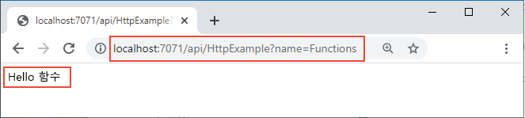

## <a name="run-the-function-locally"></a>로컬에서 함수 실행

1. *LocalFunctionProj* 폴더에서 로컬 Azure Functions 런타임 호스트를 시작하여 함수를 실행합니다.

    ```
    func start
    ```

    출력의 끝 부분에 다음 줄이 표시됩니다. 
    
    <pre>
    ...
    
    Now listening on: http://0.0.0.0:7071
    Application started. Press Ctrl+C to shut down.
    
    Http Functions:
    
            HttpExample: [GET,POST] http://localhost:7071/api/HttpExample
    ...
    
    </pre>
    
    >[!NOTE]  
    > HttpExample이 아래와 같이 표시되지 않으면 프로젝트의 루트 폴더 외부에서 호스트를 시작했을 가능성이 높습니다. 이 경우 **Ctrl**+**C** 를 사용하여 호스트를 중지하고, 프로젝트의 루트 폴더로 이동하여 이전 명령을 다시 실행합니다.

1. 이 출력에서 `HttpExample` 함수의 URL을 브라우저로 복사하고 `?name=<YOUR_NAME>` 쿼리 문자열을 추가하여 전체 URL을 `http://localhost:7071/api/HttpExample?name=Functions`와 같이 만듭니다. 브라우저에서 `Hello Functions`와 같은 메시지가 표시됩니다.

    

1. 프로젝트를 시작한 터미널에도 요청 시 로그 출력이 표시됩니다.

1. 완료되면 **Ctrl**+**C** 를 사용하고 `y`를 선택하여 함수 호스트를 중지합니다.
