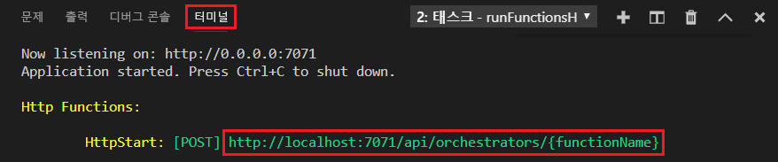

## 로컬에서 함수 실행

Azure Functions Core Tools를 사용하면 로컬 개발 컴퓨터에서 Azure Functions 프로젝트를 실행할 수 있습니다.

1. 함수를 테스트하려면 함수 코드에 중단점을 설정하고 F5 키를 눌러 함수 앱 프로젝트를 시작합니다. 핵심 도구의 출력이 **터미널** 패널에 표시됩니다.

1. **터미널** 패널에서 HTTP 트리거 함수의 URL 엔드포인트를 복사합니다. 

    

1. HTTP 요청에 대한 URL을 브라우저의 주소 표시줄에 붙여 넣습니다. 이 URL에 쿼리 문자열 `?name=<yourname>`을 추가하고 요청을 실행합니다. 중단점이 적중되는 경우 실행이 일시 중지됩니다.

1. 계속 실행하는 경우 다음과 같이 GET 요청에 대한 응답이 브라우저에 표시됩니다.

    

1. 디버깅을 중지하려면 Shift+F5를 누릅니다.