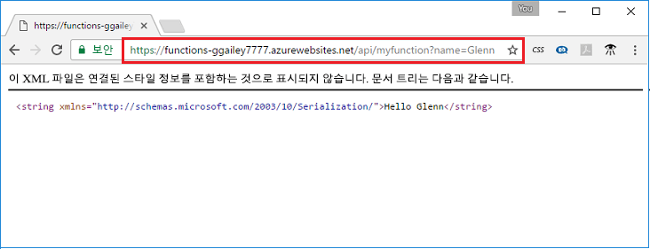

## <a name="test"></a>Azure에서 함수 테스트

cURL을 사용하여 배포된 함수를 테스트합니다. 다음 예와 같이 이전 단계에서 복사한 URL을 사용하여 쿼리 문자열 `&name=<yourname>`을 URL에 추가합니다.

```bash
curl https://myfunctionapp.azurewebsites.net/api/httptrigger?code=cCr8sAxfBiow548FBDLS1....&name=<yourname>
```

 

또한 복사한 URL을 웹 브라우저의 주소에 붙여넣을 수도 있습니다. 다시 한 번 URL에 쿼리 문자열 `&name=<yourname>`을 추가한 후 요청을 실행합니다.

  
