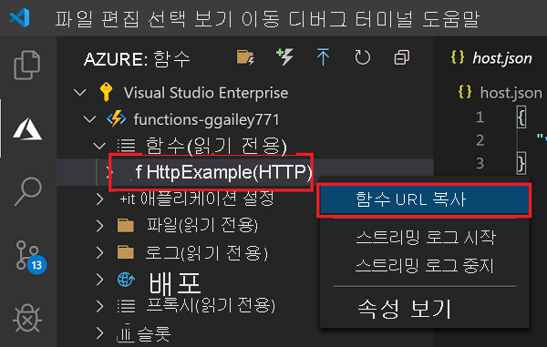

## <a name="run-the-function-in-azure"></a>Azure에서 함수 실행

1. **Azure: Functions** 영역으로 돌아가서 구독의 새 함수 앱을 확장합니다. **Functions** 를 확장하고 **HttpExample** 에서 (Windows) 또는 <kbd>Ctrl -</kbd> 클릭(macOS)을 마우스 오른쪽 단추로 클릭한 다음, **함수 URL 복사** 를 선택합니다.

    

1. HTTP 요청에 대한 이 URL을 브라우저의 주소 표시줄에 붙여넣고 `name` 쿼리 문자열을 이 URL의 끝에 `?name=Functions`로 추가한 다음, 요청을 실행합니다. HTTP 트리거 함수를 호출하는 URL은 다음 형식이어야 합니다.

    ```http
    http://<FUNCTION_APP_NAME>.azurewebsites.net/api/httpexample?name=Functions
    ```

    다음 예제에서는 함수에서 반환된 원격 GET 요청에 대한 브라우저의 응답을 보여 줍니다.

    
